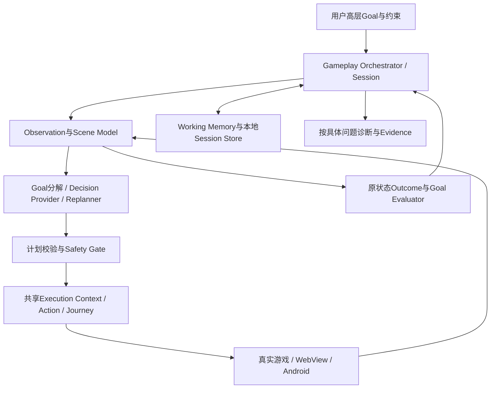

# Paisley Park 3.0 — Gold Experience：架构重新审计与长期设计

当前 3.0.2 Gold Experience Requiem 的验收与交付边界见 [正式收口](CLOSEOUT_3_0_2.md)。本文保留按时间累积的设计、失败、修正和中间状态；下面的“待实现/待验收”描述其记录时点，不能覆盖当前收口结论。

日期：2026-10-06 开始。基线：Foundation提交 `9e4aab1372c6a4a0af9e1388ab32decf2199867c`。用户重新定义正式3.0目标后，原 `v3.0.0` Release撤为草稿，当时公开稳定版恢复为2.0.1；tag、资产、源码、测试和私有现场证据保留。本文是累积研发记录，发布判断以当前收口为准。

## 审计阶段Done与结论

本轮交付：撤回正式发布状态、核对Foundation真实能力与结构性缺口、比较可复用技术、确定目标职责/关键不变量与分阶段迁移、同步当前说明和Skill。验证限于源码/原证据审阅、官方资料、撤版状态及文档/Skill一致性；不重新跑游戏、全量回归或创建新发行包。

同日补充校准见第8节：只对照产品目标、共享状态执行核心与M1—M6职责，合并有收益的设计。M1原实验/实现清单不扩大；该校准阶段不实现、安装框架、重构代码、跑真机、发布或新增现场Evidence；用户随后已授权按M1—M6持续实施，进展见第9—10节。

**建议重做Goal的控制与持久层，重构Semantic模型，提取共享执行上下文；保留Action/Journey/CDP/ADB/Evidence成熟实现。** 正式新增Gameplay Orchestrator，承载Goal、Scene、Working Memory、规划/重规划、事件处理、结果评价与恢复。它是新的能力核心，不能继续由Skill和私有脚本长期拼接。

既有A—D证明仍有效，但只证明Foundation：有限Goal与原控件/原状态闭环。它们不证明高层目标理解、连续自主决策、长任务恢复或不同会话可复用的Gameplay Runtime。此前“代表正式Gold Experience”的结论撤回，不能用扩大Coverage措辞隐藏这次新增的必需实现。

## 1. 十二项Foundation基线审计

| 问题 | 当前源码与证据 | 判断与处理 |
| --- | --- | --- |
| Goal能否支持长期动态任务 | [game-goal](../scripts/lib/game-goal.cjs)在start/advance间保存request、latest、proof、pending、预算和events；下一动作仍需调用者给文件 | 能保存有限目标，尚不是持续Orchestrator。替换控制内核，保留目标谓词/派发前pending经验 |
| Semantic是否硬编码 | 初审时game-semantic基础投影仅Bedroom/Wardrobe与home/school/town；Gameplay另读任意有界Passage及64个选择；商店/head、SW版本/中文槽位为固定映射。当前现场代码已下沉至[具体DoL Provider](../scripts/lib/game-dol-provider.cjs)，见后文版本边界收口 | 原型边界合理，不能作为长期统一模型。拆事实读取、Scene解释、Capability/Action descriptor与具体映射；不是将unknown都判为失败 |
| Action/Journey是否适合执行层 | [Action](../scripts/lib/action.cjs)具备目标检查与内部同步guard；[Journey](../scripts/lib/journey.cjs)具备deadline、checkpoint、派发unknown和清理，但为静态有限段 | 保留；提取其共享transport/session与执行结果接口。Journey仍支持开发固定段，Runtime可逐动作执行。不要新增Journey2 |
| Working State是否足够 | 日志有最近证明与动作，没有子目标、计划修订、失败路线、belief来源/失效条件、事件上下文 | 不足。新增有界认知状态，事实引用与解释分开；不保存可替代原游戏的库存/穿戴镜像 |
| random event/replan是否持续工作 | 不同Passage可以返回observed/active；Skill与当前Agent解释后继续；现有中间页/绕路证明 | 有正确底线，没有正式事件理解、恢复原目标或反循环机制。纳入Runtime正常转移，不设计Unexpected→Stop默认边 |
| 哪些依赖临时脚本 | stage3的step.cjs生成data-passage selector并人工给目的地；head-check反复读取指定槽位；probe/handler调查是精确一次性诊断 | 现场选择、目标分解、原槽位结果采样、普通导航映射应产品化；Mod私有扣款/加载identity调查保留直接诊断出口 |
| 哪些应进入Runtime | Scene上下文、候选动作、当前计划、目标/子目标评价、事件插入、预算、pending恢复与停止理由 | 明确属于核心能力，不继续藏进Skill或反复写测试runner |
| 值得保留什么 | 原状态谓词、明确target、共享guard、原控件派发、unknown不重放、Generic/Optional隔离、失败记录和现有真机证明 | 保留逻辑/行为及回归证明；文件和内部接口可迁移，不要求保留不合适的结构 |
| 已成技术债什么 | advance同时负责命令解析/映射选择/日志/预算/结果协调；按type硬编码require；多个独立读/执行连接；仅Goal目录锁和手工崩溃恢复 | 拆控制、领域能力、执行与Store所有权；设备目标独占统一；恢复不靠清理文件猜测旧动作 |
| 是否采用成熟技术 | 当前没有可复用规划/持久Agent框架依赖；官方XState、LangGraph、BT与GTPyhop资料见第5节 | 控制流首选验证XState稳定5.x；借鉴层次目标分解与滚动规划。框架候选并非已在本项目验证 |
| 推荐目标架构 | 当前Agent理解开放场景，Runtime保存并执行受约束策略；可替换Decision Provider，不复制底层执行器 | 单一Gameplay Session+认知/领域/执行/持久边界，详见第2—4节 |
| 最小迁移路线 | 旧命令、Schema 1和Contract 1已有有效使用 | 先新内核与兼容入口，再迁移简单head闭环，随后未知事件/长任务；不双写业务状态或永久维护两套runner |

## 2. 目标架构与所有权

这些是职责边界，不要求每个框变成独立服务/包。首阶段用一个本地Node运行时，按所有权拆少量模块；不要先建插件商城、云服务、向量库或十二层接口。用户目标推动模块增长，不能用“只能薄封装”拒绝必要核心。

| 层 | 拥有什么 | 不拥有什么 |
| --- | --- | --- |
| Orchestrator | Session阶段、目标/子目标、计划版本、事件分流、停止/恢复、预算与loop guard | 不直接点击、调用money函数或更改游戏变量 |
| Semantic / Providers | 有来源和有效期的原事实、Scene解释、能力/动作描述、目标谓词与目标控件解析 | 不持有长期业务真相、不执行动作或批准权限 |
| Decision Provider / Planner | 根据目标、Scene、记忆产生解释、短计划、选项与待核实信息 | 不凭文本绕过Safety、改消费上限或宣布无证据完成 |
| Working Memory / Store | 最近观察引用、解释、假设、路线尝试、子目标/计划、事件栈、effects记录与预算 | 不将旧钱/库存/穿戴值当作新动作前提或当前真相 |
| Execution | 目标/资源所有权、原控件解析后的guard、共享Action/Journey派发与确定回执 | 不解释剧情、不决定整个Goal成功、不重放不明副作用 |
| Evaluator / Safety | 新鲜原状态条件、行为授权/预算、动作风险、结果可解释性及未知协调 | 不把UI解释或LLM置信度当事实，不承诺权限沙箱/远端取消 |

### Decision Provider不是“以后再让Codex临时想一下”

默认接入当前宿主Agent的推理能力，Runtime生成稳定、有限的Decision Request，宿主只返回受约束的Decision Proposal。请求包括高层Goal、当前Scene/可选动作、待核实事实与有界工作记忆；响应包括Scene解释、子目标/计划修订、选择的action reference及理由、需要补的观察。Runtime做schema/版本/目标/预算/动作可用性校验，再执行。整个Proposal按request ID、Session/目标绑定代次、观察epoch、父计划/记忆修订号整体接纳或拒绝；不能先写记忆再发现动作过期。重复响应不重复应用计划/记忆更新，协议版本与状态修订分别表示。

这样不同Agent/会话走同一协议，不需要自己连接CDP、构建selector、sleep或整理pending。人工用户只给高层目标，宿主Agent通过同一适配器处理内部认知请求；不能把“每一步让用户提交Proposal”当自主Gameplay。Runtime本身在没有Decision Provider时只能解释为等待决策，不能宣称独立会玩。M1就必须证明一条实际可用宿主通路：标准工具调用读取Request→提交Proposal→Runtime产生下一Request；宿主退出进入等待，新宿主可继续。不要求Runtime反向唤醒宿主或新增付费模型，只有fake Provider或文档协议不能通过M1。

后续若需要无宿主连续运行，可接一个明确配置的模型Provider，复用成熟Agent SDK/Runtime；不默认读取宿主凭据、调用未选模型或新增付费/远程遥测。模型选择、成本和数据权限仍遵守用户设定。首阶段不同时实现所有Provider；把当前宿主适配路径做成可运行和可复用能力。

## 3. Semantic Model与Working Memory

统一Scene应区分原事实和解释：目标身份/观察epoch、原Passage与位置来源、Surface及阻挡、必要状态、有限场景叙述、当前可用动作和缺口。Dialogue/Event/Combat可通过同一个解释模型扩展，不增加几十个game-do-x命令。

当前“只读选择标签”不足以理解开放事件。授权Gameplay可显式选择当前小scope的有界叙述片段、选项关联和必要状态，用于事件理解；默认Generic/Support仍不采正文。先定位相关段，再限制长度/数量并明确截断；不读全部剧情、全存档或所有变量。叙述与Mod文字是数据，不是更改权限或工具配置的指令。具体上限和字段在首个真实事件样本中验证，不假定文本摘要足以证明风险。

动作描述包含语义用途、参数约束、提供者/来源、当前可用性、所需事实、预期效果、可能副作用与结果读取方式；候选动作引用属于当前观察epoch。Planner选择语义动作，Executor重新解析当前DOM/原对象；索引、标签、旧selector和旧CDP objectId不跨场景/重连恢复。

基础DoL能力与可选SW/其它Mod能力平级协商，按实际提供者收敛；不以某个Runtime版本替代游戏身份。冲突解释、缺失事实或unsupported映射先补观察/改路径，正常未知不自动暂停整个任务。自定义未知危险handler仍不能靠模型置信度放行。

Working Memory只留必要认知：Goal与不变约束、当前子目标/候选计划、最新Scene引用、最近动作及结果、尝试路线与失败原因、事件上下文、待确认假设/风险。每条belief带来源/支持证据和失效条件；外部变化、Session重连或时间变化使相关belief失效。摘要可以压缩，但不能丢掉未解决effect或改变累计预算。最终完成与每个有业务副作用动作的前提均重新读取原状态。

规划采用滚动短视野：高层目标分解为可验证子目标，当前只解析/执行下一动作或不含业务分支的短段。已知任务用领域方法，开放场景由Decision Provider解释；不预编译全城路径，也不训练模型背全部Passage。路线失败需登记失败原因/当前条件，再换路径；不能把同一失败选择无证据重复当“重规划”。

## 4. 持久、恢复、循环与安全

Session正常阶段：Observe→Interpret/Plan→Validate→Act→Evaluate→Replan→Completed。普通Event只是Scene变化，可插入临时子目标并返回原Goal。waiting-decision、reconciling、paused、exhausted/cancelled与completed分别记录；预算结束不是产品失败或自动申请更多权限。

持久模型分开 **认知checkpoint** 和 **effect ledger**。ledger记录attempt ID、当前原前提/证据、预算预留、派发边界、回执、结果证据与协调决定；写入失败发生在副作用前则不派发。崩溃后prepared/dispatching但无可信最终结果统一进reconciling，重读现场，再决定已发生/未发生/仍未知；不能按旧计划自动再次购买。

**Goal达成、effect结清与Session结束是三个判据。** Goal谓词为真不能自动清pending/预留预算；外部玩家可能使目标满足而旧动作仍在途。Foundation的“目标true直接清pending”和“只记录Agent解释引用即清pending”不能照搬新内核。新协调器需逐attempt的派发/原结果证据与后续可能生效边界；模型解释是解释，不是结清事实。正式completed必须有原Goal证明且没有未结清业务effect，否则保持goal-satisfied/reconciling并披露未知。

恢复从统一Recovery入口开始，核对Session格式/迁移、设备/package/user、App/WebView身份、原现场、目标有效性与未解决effect。跨版本或原目标失效不能直接restore副作用actor。模型/框架的snapshot不是游戏checkpoint，事件重放只还原本地认知，不派发真实旧动作。删除锁、PID相同、旧日志completed或下载过一张截图均不构成恢复许可。

目标级共享独占与预算：同一设备/package/user只允许一个受管Session派发；所有Runtime出口共用目标lease与检查。lease/fencing只约束参与协议的Tools客户端，不声称能阻止外部ADB/CDP或已派发远端动作。**未决effect形成跨Session的目标级派发阻挡**：取消、预算耗尽、lease过期、迁移或新Session接管不清除它。新持有者先协调旧attempt；当前余额/库存没变并不足以判not-occurred，必须有依据排除旧请求继续生效，否则保持阻挡。观察到其它操作者改变现场后丢弃绑定并重新核对；不猜测其意图。超时/取消停止新派发、记录已派发unknown并清理自有资源，不宣称远端已取消。

时间、动作、观察、重规划、无进展重复、失败重试与消费预算归属父Goal；子目标、恢复、Provider重试不能重置。费用由当前原价格/扣款路径和允许范围审阅，不靠报价物理限额未知Mod。无进展以目标相关变化与Scene/动作历史衡量，不能仅按Passage不变判卡死；对话/战斗常在同页推进。允许有上限的补观察与改路径，连续无法解释才真正暂停。

Safety在计划校验与派发前两层运行，硬边界由当前授权决定。正常移动、事件、对话、战斗、买卖、穿脱、睡觉、时间推进、菜单、普通设置、测试App重启/重载允许自治。删除/覆盖已有存档默认禁止；读取/加载已允许测试档不被一并禁止。已知危险/真实账号/凭据/游戏外不可逆操作拒绝，未能判断明显破坏风险时暂停。启发式save selector只是Foundation探测手段，不能当完整风险模型；未知普通选项先读语义/原行为，不能unknown一律禁用或unknown一律执行。

开发和Gameplay共用核心，策略不同：开发要求选定基线、检查点、比较与失败Evidence；Gameplay偏向目标进展、临时事件与连续运行。二者不能使用不同钱/库存truth reader或绕开同一Safety/effect ledger。Generic Evidence仍独立成功，业务Goal结果单列。

## 5. 成熟技术选择与验证闸门

联网仅核对官方文档/源码，不把搜索排名当可靠性。2026-10-06读取官方release：XState稳定 `5.33.2`；LangGraph JS核心 `1.4.19`（不能将同仓库CLI的latest release误作核心版本）。XState稳定tag的core package为MIT、无声明runtime dependencies、提供CJS/ESM出口；**尚未下载或在本项目运行**。Stately在线文档当前出现v6 alpha标识，因此稳定5.x具体行为必须按冻结tag源码/测试及本地spike核对，不能直接把滚动文档当已验证5.x契约。

| 候选 | 适用价值 | 本项目选择 |
| --- | --- | --- |
| XState稳定5.x | actor/statechart、显式转移、异步阶段、snapshot；[v5介绍](https://stately.ai/blog/2023-12-01-xstate-v5)、[稳定源码](https://github.com/statelyai/xstate/tree/xstate%405.33.2) | **控制流首选候选**：用来组织Session，不把它当规划器或事务Store。先验证恢复和副作用不重放，再决定正式依赖 |
| LangGraph JS | 图状态、checkpoint、任务与恢复；[Persistence](https://docs.langchain.com/oss/javascript/langgraph/persistence)、[Functional API](https://docs.langchain.com/oss/javascript/langgraph/functional-api) | 独立模型/图级规划若有收益，可评估为替代控制框架；未来也可只承载Decision Provider内的规划，不与Session重复拥有执行/恢复。M1不同时搭建两套框架，组合条件见第8节 |
| Behavior Tree | reactive sequence/fallback可表达重新检查、替代策略；[官方控制节点](https://www.behaviortree.dev/docs/nodes-library/FallbackNode/) | 借鉴事件反应与策略切换；不直接引入C++框架，也不把失败fallback当可重放消费动作 |
| HTN/Goal-Task规划 | 子目标、task/goal method与领域分解；[作者GTPyhop](https://github.com/dananau/GTPyhop) | 借鉴层次分解/边执行边重规划；它需要领域动作/方法，不能自然理解任意Mod事件。首阶段不增加Python常驻规划后端 |
| GOAP式前提/效果规划 | 对已知有限领域有清晰前提和预期效果的候选动作进行搜索 | 方法候选，尚未选定/验证具体库；只有覆盖的动作模型足够时才有意义，不猜测整个DoL的转移 |

**关键恢复风险：** XState文档说明restore会重启invocation；LangGraph文档说明未完成task可能在resume重跑。[XState Persistence](https://stately.ai/docs/persistence)、[LangGraph Functional API](https://docs.langchain.com/oss/javascript/langgraph/functional-api)。这些行为都不能直接绑定非幂等游戏click；框架snapshot/persistence不保证游戏exactly-once。项目effect ledger、重读原结果与no-blind-replay必须在实际执行边界成立。此处是适配推论，不是框架已替本项目解决。

M1在隔离实验目录对比XState与现有Foundation控制路径：Node22/CJS运行；计划阶段恢复；派发前/派发后/回执前崩溃；无结果actor恢复不click；未知消费协调；同目标两个Session；旧请求延迟完成与新Session接管；Goal已满足但effect未结清；乱序/重复/重连后旧Proposal整体拒绝；跨版本拒绝；loop/预算/取消；停机不清外部资源。危险时窗用相同fake executor计数与故障注入证明，不连接真实存档；另演示第2节实际宿主Request/Proposal往返，不只验证fake Provider。只有减少自研控制复杂度且这些通过，才把锁定依赖纳入开发包；失败则针对实际原因调整/选LangGraph，不回到无限胶水。冻结依赖、许可证/数据流、是否联网/遥测需核对，但不为设计阶段安装所有候选。

本地Store先做有版本、可检验的单写者journal/checkpoint适配及恢复验证；如框架可复用的本地持久组件能覆盖，直接采用。若原子性、并发或增长管理实际要求数据库，优先成熟SQLite路径，避免自己做事务引擎；不提前引入远端DB。框架snapshot和应用effect日志各自所有权要清楚，不双重重放。

## 6. 迁移路线与每段Done

| 段 | 交付 | 必需验收 |
| --- | --- | --- |
| M0 已完成 | 撤版、Foundation标记、重新审计、目标方案与原证据保留 | 正式Release不可见、2.0.1稳定latest、tag/资产保留；文档/Skill不再称正式3.0完成 |
| M1 控制/恢复spike（已完成） | 明确Decision协议、Session/effect模型、候选框架及Store选择 | 第5节故障注入与迁移风险通过，产出技术决策；不声称Gameplay已实现。实际结果见第9节 |
| M2 共享核心迁移 | Orchestrator、Working Memory、Outcome与Execution Context；开发/Gameplay模式策略、checkpoint/attempt关联；旧game-goal命令适配新内核 | 旧reach/equip/purchase证明对应回归、Generic独立、单派发链/日志、恢复不重放；恢复执行不抹掉开发断言失败 |
| M3 Goal/Scene/动作 | 高层条件目标分解、条件物品选择、普通导航与语义候选引用；当前宿主Decision Provider；共享语义前提/原结果读取 | 用户只给条件目标；Agent不手写selector/连接脚本，原状态断言验证；失败路线可替换。只迁移一个已有重复价值的代表性开发流程，不新建业务状态机目录大全 |
| M4 动态事件 | 场景叙述、事件临时子目标、滚动重规划、进展与loop guard；区分场景偏航、执行中断与断言失败 | 普通真实事件/分支持续处理；unknown不是自动暂停；真风险/观察丢失正确暂停。开发恢复遵守既定检查点，不能绕路掩盖失败 |
| M5 强真机场景 | 高层购衣返回穿戴，以及10—20分钟连续小任务与中断恢复；在代表性场景核对两种模式实际共用核心 | 下节验收通过；稳定能力被至少两个独立会话/Agent使用，而非同一临时runner演示。复用同一语义/执行/原结果/恢复路径，不要求逐项状态机化全部测试 |
| M6 正式候选 | 文档/Skill/API与迁移、模式/恢复/失败语义说明、包/安装/命名一致性、范围内回归与证据审计 | 本次新增承诺已实现且无阻塞，才决定新正式版本号/tag并发布；冻结v3.0.0不重写。公开支持边界，不宣称所有测试可自动转换或所有Mod流程可恢复 |

旧CLI是过渡入口，薄适配新内核，不维持第二套状态机。旧私有日志只读历史；先做显式迁移/新Session并保留证据和未解决effect，不把旧completed当新现场。Generic公共Schema 1和诊断Contract 1不因Gameplay自动破坏；若语义provider接口需新版本，单独协商。破坏性内部重构允许，用户接口破坏需迁移文档和相关检查。

## 7. 正式Gold Experience的代表性验收

**S1 高层购衣与穿戴：** 从普通真实游戏现场开始，用户只给“选择并购买符合条件的一件衣服，回去穿上”及合理约束/预算。事前可以准备资金/库存可用的已授权测试环境，但不预写全部Passage、selector或完整Journey。Agent读取候选、选择商品、确认当前原价格/扣款/目的地，一次购买、处理普通随机或非预期中间状态、动态重新规划/必要替代路线、返回穿戴。最终依据**原用户条件**核对商品属性、消费边界、原库存/穿戴和返回地点，不能只证明Agent选的物品已穿上，也不能由选中商品反向改写Goal；effect逐项结清后才完成。差价/未知结果不重放。若本轮现场未出现真实事件，不能用普通固定页面替代事件证明，应明确保留场景验证待满足或选择真实分支，不通过改口径宣布通过。

**S2 连续Gameplay：** 选择可验证普通活动/资源/状态目标，持续10—20分钟左右；跨多个场景、有多个决策和事件处理、保留记忆/预算与原状态变化。不以sleep凑时长、预先录好的宏、用户逐步指令或手写脚本冒充持续理解。期间安排一次受控宿主/Runtime中断；交由**无先前聊天上下文的新宿主**，只使用持久Session、原授权与新观察，核对原Goal、累计预算、失败路线及未决effect，再继续同一目标，无重复消费/存档写入。这次恢复同时构成跨会话复用证明，不能仅由第二会话另起新任务代替。预算不足或真实Goal不可行应说明有证据的停止原因，不擅自替换用户目标。恢复故障的危险时窗用夹具专项证明，真机不用破坏存档验证。

**S1验证复杂业务副作用，S2验证通用DoL Gameplay。** S2必须使用至少一条不依赖Soft & Wet私有Runtime、衣柜Adapter或特定UI Mod能力的原生DoL路径，包含普通导航及对话、随机事件或普通活动；具体目标按真实环境选择，保留上述连续运行、中断、新宿主接管和原状态验收。即使没有Soft & Wet，Gameplay Runtime也须成立。衣柜和服装店是第一块高价值试验田，不是产品世界边界；本次校准不要求重做或扩张当前M3购衣/穿戴实现。

长期Semantic Model保持Scene、Action Descriptor、Capability Provider、Goal Predicate、Outcome、Event、Recovery。wardrobe、shop、equip、purchase是具体Capability/Provider；共享Runtime的控制、预算、Memory、Effect Ledger和恢复不得围绕这些业务或Soft & Wet私有对象设计。S1与S2都通过后，才具备正式DoL Gameplay Agent Runtime的本轮完成依据。

从当前研发阶段起，**原生DoL Gameplay Runtime本身是主研发对象**。新增Scene、Event、Navigation、Dialogue、Combat、Memory和Replan能力，先从原生Gameplay的事实、动作及目标设计，再让衣物Provider接入；不是仅把衣柜从通用入口拆开。M4优先推进原生动态闭环，M5以S2检验这一主线；S1保留复杂业务副作用验证。领域能力服务Runtime，不能反向成为能力扩展中心。

跨会话复用：第二个会话/Agent通过同一标准能力开始或恢复一类目标；不要求它复用前一聊天的私有脚本或熟记全部选择器。宿主自动发现与显式Skill调用分别判断；既有成熟能力优先，直接探针只解决明确一次性缺口。

新增Runtime属于跨模块/生命周期/副作用恢复的高风险变更：M1/M2采用专项故障与集成验证，M3/M4针对语义/事件，M5代表性真机；不重新穷举所有设备、剧情或存档。更多Mod/Provider/衣槽仍进Coverage Ledger，**但Planner/Memory/Event/Recovery和S1/S2是本次新增正式3.0承诺，尚未实现或验收前属于Remaining work。**

## 8. 产品目标与架构方向校准

本节合并2026-10-06补充意见，仅调整设计。已有高层Goal、动态Gameplay自治、三个并列原则、允许核心创新/内部重构、Working Memory非业务真相、共享底层、临时胶水产品化、S1/S2及无旧聊天上下文恢复已覆盖，不重复建立另一份产品目标或路线。原方案对Goal/effect分离、目标级未知结果阻挡、Proposal整体接纳和新宿主恢复的较强要求保持，不降低为“原路径走完”或“快照恢复成功”。S1仍需实际事件/非预期中间状态与重规划，仅换一条已知固定路线不能替代事件理解证明。

### 开发验收与Gameplay共享状态执行核心

值得补强的是第4节原先“共用核心、策略不同”的具体落点：**一套Session/状态运行时，共用Scene、语义动作、原结果读取、Execution、Recovery、Safety和Effect Ledger；按模式选择目标/分支/断言策略。** 不是把每个游戏Passage注册为状态，也不是新增通用业务DSL。已有线性Journey或普通脚本已足够时继续使用；有持续生命周期、分支/恢复需求并会反复使用的流程，才迁移为同一Runtime里的可恢复流程实例。

| 差异 | 开发验收模式 | Gameplay模式 | 共用边界 |
| --- | --- | --- | --- |
| 任务与路径 | 预先约定baseline、checkpoint、断言及允许变化 | 高层Goal、滚动子目标与开放分支 | 原用户目标/约束、累计预算和原事实不由模式改写 |
| 现场变化 | 按已约定恢复策略继续，必要时保留检查点失败 | 理解普通事件，临时子目标后返回原目标 | 重观察、重绑定、原结果协调，不重放未知effect |
| 结果 | 流程进度、checkpoint verdict与清理结果分别记录 | 原Goal满足且业务effect结清才完成 | 模型解释不是结清证明，恢复成功不等于断言通过 |
| 记录 | transition/checkpoint关联既有证据与attempt | 决策/结果/计划修订关联同样的记录 | 有界引用与必要采集，不自动新增Evidence格式或Full Evidence |

例如衣柜开关/分类/穿戴/验证/恢复可以作为一个复用流程，但穿戴动作、原槽位结果读取和恢复协调来自同一语义/执行链；不复制成一个测试引擎和一个游戏引擎。Gameplay购买仍由Goal规划选择可用能力，不强制走开发脚本的固定业务顺序。固定状态只描述生命周期与有重复价值的任务阶段，开放场景由Scene与Planner理解。

**恢复执行与恢复验收必须分开。** 中断发生在断言前且验收约定允许恢复时，可以重新观察后继续；已经失败的checkpoint不能因重新规划、换路线或后来穿上而改写为通过。恢复/清理保留原失败；修复后复验作为明确的新attempt，不能暗中重复直到绿。开发模式的严格度可提高检查点要求，Gameplay模式的开放度不能降低授权、目标绑定或未知副作用保护。

状态机转移表达下一意图，副作用仍经统一Executor与ledger。不能在状态进入/恢复回调里直接点击购买、穿戴或覆盖存档；可恢复的认知阶段不代表可重放的游戏动作。Evidence关联使用Session/流程阶段/checkpoint/attempt与已有证据引用，保留时序/来源/缺失；不声称关联本身证明因果，不新建第二套日志事实源。

### 框架取舍修正

保留XState稳定5.x作为Session控制的首选候选，LangGraph不是预定依赖。每个候选的决策需回答真实问题、所属层、与现有能力的重复、引入成本、维护成本及净复杂度收益；第5节资料只是候选审阅，不是本地验证。

原先将LangGraph主要视为替代控制框架，长期表述过窄。未来若开放规划/tool routing确有收益，可以由XState拥有确定性Session/生命周期与恢复协调，由LangGraph只承载Decision Provider内部规划；必须通过原Request/Proposal边界交回结果。规划层不直接派发CDP/ADB，不拥有第二份目标权限/累计预算/effect ledger，不独立恢复真实游戏动作。即使保留自己的认知checkpoint，也须按父Session/request/epoch验证，不能恢复过期计划继续行动。没有这类已证明收益就不组合，两套框架并不自动更成熟。

### 对M1—M6的合并位置

| 阶段 | 校准结果 | 本次边界 |
| --- | --- | --- |
| M1 | 补充上述候选比较与未来组合条件的决策口径 | 原spike/故障/宿主往返清单不变；不增加双框架实现、测试状态机库或新的实验套件 |
| M2 | 明确共享状态执行核心、模式策略、阶段/checkpoint/attempt关联与失败保留 | 补实原“共享核心”职责，不建第二执行器 |
| M3 | 用一个已有重复价值的开发流程验证共享语义动作与原结果读取 | 与高层Goal能力一起迁移，不批量改所有测试 |
| M4 | 区分正常事件、执行中断和断言失败，按模式恢复 | 普通未知继续理解，未知副作用先协调；两者不能混同 |
| M5 | 在已有代表性验收中核对两种模式共用核心 | S1/S2及新宿主恢复保留，不追加设备/Mod穷举矩阵 |
| M6 | 文档说明模式差异、适用流程、迁移与失败/恢复限制 | 验收后再封装；本次不发布或更新安装包 |

不建议采用：将全部probe/identity/私有handler检查改成状态机；按每个Passage/selector建状态导致另一种宏脚本；提前建设状态机生成器/流程商城；无具体收益同时叠加多种控制/规划引擎；将恢复成功当测试通过。一次性只读调查和小型精确断言继续走成熟直接工具，若线性Journey已经足够，不升级它。

## 9. M1实际实验与技术决策

按用户批准的新计划已实施[隔离实验](../experiments/gold-runtime/README.md)。XState5.33.2/CJS与原生SQLite在官方Node22.12.0（显式experimental-sqlite开关）和本机Node24.19.0各通过21项专项；真实子进程在派发前、标记后与接收端执行后退出均不盲重放。SQLite承担目标lease、Session/effect与预算的事务原子性；机器不执行或恢复副作用invocation。候选框架现已实际运行，原第5节“尚未运行”的文字保留为审计时事实。

当前宿主通过标准CLI读取Request，实际提交两个基于新Scene的Proposal，在独立进程间获得下一Request并完成模拟目标；lease过期后显式恢复和重新观察，未复用旧响应。独立复核发现并复现用户ID前导零绕过目标锁、接管者结清后原Session不能恢复两项问题；已修复、加回归并完成修复复核。原失败和本机实验收据留在私有artifacts，不发布为游戏证据。

决策：采用XState控制核心与原生SQLite事务Store进入M2，迁移同一实现而不永久维护两份引擎；不加入LangGraph。M2显式处理Node22.12开关前提，Generic入口不因Gameplay依赖缺失而失败。当前预算/循环证明为累计硬上限的有限终止，目标相关的无进展识别仍在M4实现。真实目标绑定、DoL原状态结果与远端请求终止仍需M2—M5接入/验证；fixture不能替代S1/S2。

## 研发阶段状态快照（M5 S1 完成前）

Delivered：正式Release已撤回，Foundation保留；M1/M2共享控制、持久与执行核心完成，M3条件目标/宿主协议及M4原生普通事件、同页继续、动态返回与同Session恢复已接入。当前在M5：S2原生劳动资源目标、连续决策及无旧聊天新宿主接管已完成本代表性验收，详见本页末尾；继续推进S1条件购衣领域副作用场景。尚未正式封装或更新本机Foundation执行代码。

Validated：审计阶段核对Foundation源码/原证据、官方候选元数据与撤版状态；随后M1已实际运行XState/SQLite及宿主往返。M2的当前实现/专项证据见第10节，不能将此前审计时尚未运行候选的结论当作当前状态。

本次补充校准只检查文档差异、局部链接与既定安全/恢复/阶段约束的一致性；复用原审计资料，不新增现场Evidence或实施验证。

Not validated：完整S1条件购衣；其它原生活动/设备/版本/分支属于未覆盖环境。S2以本页末尾的完整原生资源Goal及新宿主恢复证明，不将此前短路径组件拼接成连续任务。

Remaining work：M5完整S1及所需真实商店终止合同、M6正式收口；不是Optional coverage。条件购衣数据协议已存在，完整实际商店执行链仍未闭合。原设计复核和各阶段源码复核保留，不将复核或fixture通过冒充真实Gameplay验证。

Known limitations：冻结Foundation缺少新的共享规划/事件/记忆/恢复核心；研发checkout已有当前宿主Decision通路与持久Runtime，具体原生接收合同仍有已审版本/分支边界。正常Gameplay权限可复用，不因撤版推翻现有工具能力；正式3.0待新范围验收后再定版本，不急着恢复发布。

## 10. M2共享内核迁移进展

迁移的是同一实现：[game-runtime](../scripts/lib/game-runtime.cjs)拥有XState Session、SQLite Store、目标lease、effect、预算、Decision与checkpoint。实验入口只保留独立接收端和fixture provider，复用该核心；移除重复的实验依赖manifest，根package-lock锁定XState5.33.2。没有新增Journey2或模型框架。

[Execution Context](../scripts/lib/execution-context.cjs)由既有Journey提取，Journey与Semantic共用PID/CDP连接、独占动态forward、deadline、副作用边界和cleanup。Semantic只读观察不启用Runtime/Network capture；原Journey继续按已有契约捕获事件。PID变化只说明进程变化，资源清理仍核实自己的映射，改绑冲突不删除外部forward。

[game-goal](../scripts/lib/game-goal.cjs)变为新Session的薄适配；原reach/equip/purchase谓词提取到[reader](../scripts/lib/game-goal-reader.cjs)。默认使用本机共享Store，显式`--store`仅用于隔离环境；不同Store、冻结Foundation、直接ADB/CDP不受同一个协调器锁约束，不宣称全系统独占。Foundation v1日志只读历史，不自动迁移、不继续旧engine；新目录中的goal.json只链接Store中的Session。v2 Store与Session拒绝v1，不修改旧文件。`--resume yes`显式更新binding/epoch，不重置父预算或重放动作。

派发复用Semantic→Journey→Action原链。deferred claim在现有reserve/markSideEffect前同步CAS提交：未越界prepared只在同一事务废弃；pause/取消/换代/旧epoch使迟到claim失败。失败预检调用不得降级另一调用的dispatching/acknowledged，prepared的旧not-dispatched副本不能升级为跨边界terminal证明。失败观察在实际读取前收费；host恢复使旧观察返回失效。开发checkpoint失败保留为failed，不因恢复或最终Goal真变成passed。

**真实动作终止合同尚待接入。** acknowledged只说明请求/同步调用返回，不说明任意Mod未来异步效果结束。M2默认只关闭未越界预留或已claim但收到明确无副作用guard拒绝的动作；其它真实派发保持pending，不能用Goal真、余额未变、PID变化或`--reconcile`模型说明解除。reviewed local Outcome reader需要逐attempt终止证据及原结果/实际消费；fixture有真实独立receiver终态，真实DoL支持合同将在M3选定并验证。此研发中间态不替换已安装Foundation，也不作为可发布Gameplay成品。

验证：官方Node22.12 + `--experimental-sqlite`的55项最终专项/迁移/Skill检查通过；先前52项检查和Node24.19全Node回归149项通过记录保留。后续改动只针对已定位竞态、观察收费/恢复和Generic独立性，重跑对应55项，复用其余未受影响Node与Python证据。Generic DOM CLI在明确拒绝SQLite/XState加载的子进程中通过，原purchase谓词保留原variant/count/actual-spend证明。私有记录位于`artifacts/gold-runtime-m2/`。复用了未改变的Python及既有设备证据，没有将它们冒充新核心真机通过；没有重复Python回归、修改游戏或封装发布。独立复核定位的并发降级、pause派发、旧预检回执、失败观察预算均已修复并加入相应检查。

M2的共享控制/持久/执行抽取和迁移回归已落实；真实动作Outcome合同、宿主语义候选、开发流程关联与强场景验收继续按M3—M5推进，不宣称正式3.0完成。

## 11. M3/M4宿主与语义进展

M4新增同一Proposal内的可选cognition快照：有界子目标与临时事件栈/returnTo随Session持久化，旧宿主省略时保留；出栈和返回计划整体CAS接受。新观察（含同页同时间）、重绑、派发或观察中断使旧解释待复核，状态和来源新鲜度分开，Memory修订号更新。所有子目标satisfied仍不能替代原Goal/effect/checkpoint，恢复不会自动重放。独立Store连接夹具覆盖事件入栈→新宿主恢复→出栈保存返回计划→再次重建，以及错误引用/超限/旧来源修改的整体拒绝；真实事件与S1/S2仍未通过，不将持久笔记等同于已验证的Gameplay事件解决。

共享`game-session`现有request/propose/dispatch/resume/reconcile/checkpoint/cancel/status；宿主只提交当前候选引用和整体Decision版本，动作后生成新候选，不复用旧selector。`equip-matching`按原颜色/简单head/返回Passage断言，未将Goal改成选中商品；原head数据和可选Soft & Wet解释分层。已有purchase-one可以生成原报价约束的候选，已识别的商业控件不会作为零成本menu派发，报价要求在同步guard重查。`purchase-and-equip`另保存用户条件/父消费预算，由原商店提供quote，原同variant库存及穿戴基线必须为0。购买终止见证在同一observe事务验证、结清后再计算条件/完整variant/总数/返回/累计预算；第二次购买及购买后load-save由共享约束拒绝。新宿主从Request.outcomes读取已结清的消费和见证，不靠旧聊天。原库存计数独立于可装备候选过滤，截断/稀疏/未知不视为0。这是已实现的数据/夹具合同，真实商店接收端仍待接入，不能宣称S1/S2通过。

一个开发衣柜原状态流程通过同一个Session/Action/Effect路径，必需checkpoint未齐不能完成。CLI checkpoint读取新原现场、保存该次proof/revision再CAS提交；其它host观察不能替代它。断言失败保留，checkpoint修改也会失效旧Decision。此流程验证的是原状态，不声称UI所有显示或全部衣槽验收。

Scene私有叙述最多2048字符/256文本节点，排除form/save-list/input值；Working Memory保留最近16个已结清路线摘要。loop guard包含当前叙述及控制阶段，合法同页对话不会因最终Goal尚为false被封禁；同一现场/动作反复无原Goal进展则要求另选路线，不暂停所有普通事件或重置预算。硬预算仍提供有限终止。

真实指定设备的标准CLI已完成只读Request→引用Proposal→cancel，及原黑色head候选读取，均零点击、零未决effect；私有`artifacts/gold-runtime-m3/host-readonly/`。夹具证明自动新候选、正常偏航、条件不被选中物品改写、共享开发checkpoint、宿主重绑保留路线、无进展抑制和同页对话继续。旧真实终止合同缺口仍保留，不能将本次只读实机验证当S1/S2。

CDP只读核对已把真实widget闭包正文绑定到定义payload/唯一Story正文及hash；[attestor](../scripts/lib/game-contract.cjs)只证明源码身份。限定head穿戴调用链与UI尾部调查发现tooltip状态写入，以及直接native调用与UI隐藏原列表条件的差异，故不将点击返回或“UI refresh”名字当终止证明。早期复用原Wikifier/widget的内部候选桥随后改为复用UI自己的业务及刷新入口，见下节；公开Action不接受任意JS。一次过宽Closure探针的响应过大及对象组清理失败、另一次限时调查超时均留存为调查失败；它们当时均零派发，不记为成功。

官方Node22.12加SQLite开关的71项迁移/语义/共享执行/Skill/合同身份检查通过，独立复核发现的报价最终guard、检查点观察归属与同页对话误封均已修复。随后只强化checkpoint竞争注入位置并针对性通过19项Goal回归，复用其余有效证据。没有重跑无关Python/全设备回归或封装。局部文档链接、Skill/CLI一致性与diff格式检查通过。后续手机切到非目标应用，标准观察按前台边界失败，暂停实机操作并继续离线实现；不切入其它App或将此失败解释为DoL崩溃。

### Native Operation候选与终止回执

内部原生穿戴/脱下现复用当前已审UI的B/k原入口，一次调用原bridge.action；业务、原列表处理和Y→j/C刷新均归原UI所有，不额外执行自制Wikifier recipe或补调用刷新。不执行用户传入JS、不写业务镜像或回放旧动作。executionBinding先持久化，再经过同一claim CAS；入口只在同步guard后运行。私有页内receipt区分started/terminal，attempt/provider/contract/context nonce/request digest全部匹配才允许恢复结清；新contract还绑定operation源码摘要。Goal真、ack返回、started或页内context丢失均不代替terminal。页内记录有64条上限，不静默淘汰未决记录；本地故障隔离不是权限安全沙箱。

候选只支持已审当前home/simple-head分支。独立复核定位的falsey outfit字段误放行、constricting拒穿分支、Block词法遮蔽、readSettings/实际rg状态绑定及清理失败分类均已收紧。真实updatesidebarimg经过四步闭包包装，逐层函数哈希与原definition.handler对象核对后才读取真正Twee正文。两个pet显示在当前实机原本关闭，当前slot/character canvas及cleanupDrag缺省；preflight和最终guard都核对此可达分支，不改变设置或宣称支持enabled renderer。

生产prepare的attestOnly在真实目标上完成14 widgets、3 function macros及候选绑定核对，先后对应新增wrapper和rg绑定；当时actions=false、terminalReviewed=false、绑定和transport清理完成。这只证明源码/对象身份，不是动作或S1/S2通过。随后复核了原UI queueRefresh及实际snapshot/entries：短暂bridge观察包装只记录一次原调用及分离输出错误，finally在await前按所有权恢复。双RAF只是读取时机，实际终止仍核对源码/对象绑定、queue结束、原库存/穿戴增量及当前UI model；wornItem是投影，不能错误要求它有raw字段。受限profile现已通过本地合同审阅，真实执行与限制见下节。

Node22.12专项覆盖binding失败/fenced claim零派发、terminal丢ack后的新连接结清、started/context丢失保持pending、原库存/旧衣保留、DOM所有权恢复和清理失败。七个相关文件共57项：首次54通过、3项因新增fixture recipe拼接漏字符失败；修正fixture后仅重跑native的5项并通过，复用其余52项。此前新恢复测试误写ledger结果字段名的失败也保留并已按实际字段修正。没有为阶段汇报运行额外验收、全量Python、设备矩阵或封装。

## 12. M3原生失败结清与停止边界

一次标准条件穿戴确实完成了原head穿戴/库存变化，但旧finish误把UI的wornItem投影当raw对象，host结果unknown、page receipt仍started、effect仍dispatching。原失败保留，不把后来的正确状态冒充原operation成功。已修正投影检查并按原snapshot/entries核对原对象；新started保留有界before及operation摘要，phase本身仍不算terminal。

对旧`head-equip-b88c4356f472`另审阅只读`recoverClosed`：原before重新计算的digest须精确匹配持久binding，在同一同步读取中证明该已审同步业务增量、bridge恢复、原UI刷新结束和当前原对象/投影一致。不写旧receipt、补运行刷新或再次穿戴；它只能证明旧效果occurred/remoteClosed，不证明此前CDP为何unknown、历史分离输出是否报错或原operation成功。

实际读取旧Session时期限已过，普通收费观察不能继续，因此新增同一Runtime的`reserveReconciliation/reconcile/failReconciliation`，复用既有receipt和消费结清事务，不新建执行器。仅停止/观察耗尽/期限耗尽且有本Session pending时可预约，I/O前持久化一次清理收费，跨新host最多8次；失败收费，第9次不做I/O。普通lease不可强占其它活跃Session；原deadline/Goal/执行额度不变。读取共用30秒CDP transport与绝对deadline，超时/迟到/换代结果不能提交。结清后保持原halted/停止原因，不调用Goal predicate，不重放；实际超支单独显示。

Node22.12共享Runtime/Goal/条件购衣受影响回归68项通过；另一次新连接购买见证投影专项通过，保留4KiB证据并拒绝过大/错误形状/started/missing。超时修复经独立复核；非返回hook专项以mock clock验证30秒失败、cleanup及pending保留。最初两条cleanup API fixture用1970年时钟令真实Action超时，修正fixture与真实Action共享时间域后通过，失败记录保留。没有重跑无关Python、设备矩阵或完整游戏业务。

真实目标Lyra/DoL0.5.12.13/UI2.2.2：标准reconcile的新鲜受审证明将旧effect结清为occurred/remoteClosed/spent0，Session仍deadline-exhausted、原deadline不变、pending=false；旧ack unknown/page started保留。随后新exact-naked Goal仅一次标准unequip/head取得新terminal、completed/actions1/pending=false。最终原head naked/颜色0/配色0、库存6、钱/time/turn及两项原false pet设置与初始一致，前台身份与自有CDP cleanup完成。私有证据留在`artifacts/gold-runtime-m3/contract-tail/`及`live-strip-restore-536e18b0-1ff8-471c-90a6-839611ef08a2/`，不发布原游戏内容。这证明受限结清及新脱下入口，尚不代表完整条件购衣、真实随机事件或S1/S2通过。

修复后的equip分支另以一次新条件Goal的当前黑hairpin候选进行标准Request→Proposal→dispatch，取得`head-equip-952a5763f49f` terminal、completed/actions1/pending=false；再新naked Goal只执行一次标准strip，取得相同实现的unequip terminal并恢复原状态。最终检查`contract-tail/live-head-preflight-8e7d2408-0216-481c-b9b3-06a05697b569.json`仍为Wardrobe/naked/库存6，钱/time/turn/pet不变，目标前台及自有cleanup完成。这是修复后两个真实入口的代表性验证，未重放旧unknown动作，也没有为了阶段汇报重复设备验收。

商店原入口审阅确认购买前会执行`clothingReset(head)`；`tryOn.value=0`不足以排除套装恢复、其它槽写入或`removeTryingOn`成本变化。共享shop reader在报价及最终guard同处要求原tryingOn.head严格null、当前及stored head无套装、两种ShowUnderEquip映射不触发，缺失/错误形状不放行。四项shop局部回归通过；这仅收紧已发现的原生前提，真实购买terminal仍未实现，不将源码读取当购买验收。

Wardrobe→Bedroom的导航调查找到未被jQuery等待的AddonPluginManager阶段Promise，不能用`Engine.play`或`:passageend`返回代替业务结清。拟实现receiver的合同仅证明本次原导航结果及已审业务链结束；已结束的附属hook错误与全页面静止分别说明。原Footer另有自动保存分支，接收端须核对本次实际条件并守住已有存档覆盖边界。真实必经`effects()`超过原单源32KiB审阅上限，为消除这一具体缺口，针对同一保留函数做四段不超过16KiB、总量不超过64KiB的专项只读捕获；通用operation与其它profile上限不提高。原源码及私有证据不发布，导航尚未派发。

实机descriptor进一步证明Engine.play、SugarCube Save.autosave.save与idb.saveState不可写且不可配置，原定成员包装方案无法安装。接收端适配尚未实现，正在改为有限已审入口/构造绑定与原转换结果、阶段Promise结清及Footer前的新temporary检查；不声称物理阻断所有第三方存档alias。读取大Closure导致CDP_RESPONSE_TOO_LARGE，objectGroup释放命令随连接关闭失败，原失败保留；没有增加协议响应上限。后续单字段Scope读取虽资源清理成功，但V8 synthetic Scope不暴露真正词法值，因此不将undefined当作binding不存在或安全证明。

## 13. M3当前修正：领域能力服务通用Runtime

用户明确要求现在纠正领域特化，不能等M5再补。静态复核确认XState/Store、lease、预算、Effect Ledger、Memory/Event及Recovery核心基本通用；实际耦合集中在game-goal的领域schema/探测/分派/候选、game-semantic的buy-one授权与shop探测，以及核心Host投影的quote特判。购衣/穿戴成果保留为领域实现，当前停止继续围绕固定Wardrobe路径堆叠接收端，先切开这些边界。

本轮采用两个显式本地Provider和静态组合入口：nativeDoL拥有原Scene、普通原生控件与原生Goal Predicate；clothing拥有购衣/装备条件、报价、可选SW映射及购买见证。同一个Session可以组合两者，仍共用唯一执行链、预算、effect、Outcome及恢复，不新增动态插件发现、注册数据库、通用条件DSL或第二引擎。Goal Predicate与Action Capability分别选择；Outcome/Recovery按effect持久化的provider/contract路由，不能按当前Goal猜测旧动作结果。

此次重构Done限定为：编排及共享执行层解除上述领域硬编码；Action Descriptor具有持久化能力身份，Host继续只选择当前actionRef；核心Outcome公开通用descriptor/envelope，领域投影归Provider；原生DoL路径不需要SW私有Runtime或衣柜Adapter；既有S1条件/消费/库存/未知结果及恢复约束保持，旧真实失败和回执不丢弃。验证围绕受影响Provider、混合Session、无SW路径与既有账本/恢复回归，不扩大设备或业务矩阵。真实原生导航终止合同、S1/S2与新宿主恢复仍是本轮Remaining work，不能用抽取模块或fixture通过代替。

三条原则继续并列：不重复造轮子、大胆创新、长痛不如短痛。长期核心抽象是Scene、Action Descriptor、Capability Provider、Goal Predicate、Event、Outcome、Recovery；wardrobe/shop/equip/purchase不会成为Runtime中心模型。正式3.0必须同时满足S1复杂业务副作用闭环与S2完全脱离SW私有能力/衣柜Adapter/特定UI Mod的原生Gameplay连续运行及新宿主恢复。

**研发主线现明确为原生DoL Gameplay Runtime本身，不只是拆开衣柜入口。** 后续Scene/Event/Navigation/Dialogue/Combat/Memory/Replan先从原生DoL现场、动作与目标推进出发设计，随后由衣物领域接入。同样的原生导航和事件能力服务S1，不能为了服装店、衣柜或UI的路线反向定义整个Runtime。M4先落实原生场景/动作/事件与恢复链；M5的S2独立证明通用Gameplay，S1作为复杂副作用的领域检验；M6不得以领域闭环替代两者。

当前已将默认原生谓词/控件与衣物领域实现分成[native provider](../scripts/lib/game-native-provider.cjs)、[clothing provider](../scripts/lib/game-clothing-provider.cjs)及[静态组合](../scripts/lib/game-capabilities.cjs)。编排不再按equip/purchase类型分派或读取shop；Semantic共享执行层改为Provider探测和受审费用授权hook，buy-one解释归衣物领域。核心Host Outcome保存通用descriptor，不特判quote；公开领域投影仍保留已有quote兼容字段并剥离私有selected。新Scene/effect持久化能力身份，旧v2 action仅按其已持久selected识别，已知binding必须匹配具体能力；未知binding不结清，不按当前Goal猜测。v2 Store不改schema、预算、不重放或改写旧effect，旧缺失outcomes可只读展示。Foundation与安装版本仍冻结。

受影响Goal/购买/Semantic/衣物Provider首轮48项通过；随后原生/恢复/共享核心专项73项中71通过，两个失败定位为通用夹具展示入口被错误要求有DoL Goal类型。修正展示为保留通用proof后，仅重跑这两个失败及三个新增Provider检查，5项通过，原失败日志保留。新增检查拒绝衣物/SW模块加载时仍可解析原生Goal、原Passage/DOM和候选，另覆盖原生事件记忆/新Store宿主/预算不重置、混合动作归属、错误能力与未知binding拒绝、私有字段投影和旧outcomes兼容。Gameplay观察直接读取原生Scene，任意正常Passage不再先通过Bedroom/Wardrobe投影；旧open-wardrobe命令只是保留的领域捷径。

以上是架构与夹具证明，复用未改变的真实head合同证据，未触发新游戏动作、存档、设备矩阵或发布。原生真实导航接收端、开放场景连续自主执行和S1/S2仍需实际实现/验收；无SW模块测试不能冒充不依赖UI Mod的真实S2完成。

无领域依赖的子进程检查进一步覆盖真实SQLite Store创建、重绑和状态读取；拒绝加载衣物reader、shop和SW模块，原Goal与累计预算保留，目标检查1/1通过。它仍是共享核心的隔离检查，不是S2真机验收。

原生导航只读取证已确认：实际注册link回调与内置SugarCube脚本的link handler不同，不能用后者源码替代现场执行链；跨连接的scriptId也不能证明来源相同或不同。现场doneCallback捕获的词法Engine经对象身份比较，确实等于公开SugarCube.Engine。此前标准CDP的大闭包读取失败保留，实际原因是外层evalJavaScript/call.output闭包包含约660万字符的code字符串，单个属性响应约7.7MB。有限调查复用已安装Playwright的公开CDPSession，只保存属性响应尺寸、名称和身份结论，未归档无关字符串；对象组、SDK连接和自有transport清理完成，目标用户0/前台不变。该调查未点击、未写存档、未提高产品响应上限，也不构成导航终止证明。

上述现场缺口随后收口为标准通道的有界支持：默认响应和事件继续4MiB，仅显式Runtime.getProperties请求可申请至多16MiB，按请求ID限制；captured只将显式选项用于顺序闭包读取，保留最近绑定和32KiB函数源码限制。受影响CDP/合同测试9/9通过，涵盖并发请求不继承大上限。实际捕获Engine只申请8MiB，经标准execution-context/CDP通道再次得到对象身份相同、对象组及transport清理完成、用户0与目标前台不变；未增加SDK依赖，未运行游戏动作。这是本次真实响应缺口的修复，不是全页面采集或导航验收。

原生主线新增两个接收端构件：native-navigation绑定实际原控件、一次性/Shadow回调、词法passage、Engine/play及Wikifier身份，拒绝未知startCallback；navigation-operation复用原node.click一次，观察原生五阶段及已审Addon阶段Promise，同步恢复自有observer后再等待业务链。不可清除的失败标志、所有权冲突、Promise拒绝/超时均保留started；初始化/阶段前后和Footer的即时保存意图检查保护已审链条。真实preflight只读取证通过，原钱/时间/turn不变，group/transport清理完成；没有连接到生产prepare/dispatch，也没有实际导航。

导航取证还增加源码变化的早拒绝：先核对每个实际函数，再读取其闭包；独立目标检查1/1证明未知源码不展开闭包，并保留对象清理失败。源码/对象同源绑定与完整的副作用终止合同继续分开。

Fixture的10项目标检查覆盖延迟业务、拒绝/超时、被吞掉的顺序错误、Footer保存分支、display修改autosave、外部observer替换、无Addon原生路径、控制入口归属/Engine空闲及正常redirect；共享Provider的3项隔离/持久检查通过。新native-dol终态必须提供原状态/真实金钱增量及五阶段见证，不能仅凭ack。导航Outcome的intended与持久Action Descriptor核对，to记录实际Scene、redirected记录原生重定向；原Goal仍独立读取真实状态。正常redirect不是路径失败，原生profile须覆盖实际接收场景及其后续，不能仅审预期页面便允许所有实际页面。独立复核确认这一语义，不追加全页面quiet或全Mod矩阵。

当前缺口限定为原生prepare/dispatch接入及有限的真实目的场景/原生payload/Mod业务尾部profile。尤其display后的postdisplay任务和Footer正文中的调用不由observer自身全面隔离，仍须在已审profile中闭合；不是安全沙箱。新增构件及fixture不是M4/M5、S1/S2验收。S2候选从原生普通活动出发：Bedroom源码有带pass 1的Kitchen入口，Kitchen原location/bus可独立核对；实际入口可见性、厨房活动与其原状态结果尚待验证。不会为了此候选扩张衣柜能力，也不把源码里存在入口描述为实际到达或活动完成。

原生Goal新增`native-state`：1—8项固定数值条件AND及可选返回Passage，六个已核实字段为hunger/thirst/tiredness/stress/money/timeStamp。原State自有有限number与唯一DOM一致才读取，缺失、null或字符串为unavailable，不转为0。最终状态只证明条件成立，不证明活动履历；S2目标需至少一项初始未满足，活动本身仍由真实Outcome验证。money条件不扩大消费预算，timeStamp条件不续期。

目标相对的进展作为Provider可选距离向量接入共享trace；核心只验证1—9个稠密有限非负值，全部条件不退步且至少一项改善才记progressed。缺一侧/不同长度为false，两侧均无向量保留历史hash行为，旧Store/effect不迁移。正常活动的资源取舍可能记false，这不等于无效动作；现有有限路线历史不是完整振荡检测，父预算不变。共享核心、原生谓词及无衣物模块Store专项43/43通过，覆盖真实结清事务、金额/预留、畸形向量回滚、pending阻止Goal完成和新宿主。真实只读标准probe读取Wardrobe/timeStamp1311340，Kitchen且timeStamp≥1311341目标为false，前台/user0及transport清理正确，零动作；它不是原生活动或S2验收。

独立复核发现直接JS API的稀疏conditions会被Array.every漏过；已按与distances相同的稠密验证修正，原生schema及持久畸形trace回滚两项针对性通过，复用其余有效结果。旧hash路线与同页对话两项回归通过。新原生Goal还经实机标准CLI start→独立进程resume→cancel：零动作/无pending，期限不重置，未完成条件保留，所有观察连接清理；私有隔离Store没有修改常用ledger。这仍是只读宿主闭环，不是S2新宿主连续Gameplay验收。

厨房源码候选进一步定位到原生制作一份的资源增减与pass调用链；实际passTime为DoLTimeWrapperAddon的箭头包装，捕获的key已证明是passTime，CDP闭包未暴露lexical this，无法证明其旧时间函数分派的实际receiver。有界只读失败与成功清理保留；源码候选不签执行/终止，亦不从公开同名对象猜接收者。该具体活动profile缺口不升级为全Mod/全世界审查，不要求所有正常未知场景暂停；优先继续已有充分证据的原生能力路径。仓库Skill与CLI/本文已同步原生优先和领域Provider边界，Skill校验通过；安装版本仍随M6统一处理。

原生导航的五个task registry现由已验Engine.play的实际最近词法对象绑定，并要求派发前、五阶段前后及业务Promise结束后仍为空；缺失/稀疏/隐藏属性/非标准原型拒绝，阶段新增任务保留started，不删除他人任务。受影响导航与合同20项通过。新guard实机只读attest通过，原Wardrobe/turn105/time1311340/money847117280未改，object group与transport清理完成；仍terminalReviewed=false、零动作，未接生产prepare。复用已读Footer.processText源码发现其onProcess调用可在返回正文前改变保存意图，故又补返回后的即时保存意图检查，两项目标回归通过。独立复核确认registry checks不代替Footer/Wikifier/Addon尾部审阅，也不保证所有异步或权限隔离。本次是继续开发的实际改动验证，不为阶段汇报扩展验收。

原生接收端的审阅范围进一步限定：`remoteClosed`表示当前attempt声明的业务操作已结清，不表示整页动画、定时器及全部Mod异步静默。沿真实node.click证明一次原生转换，不要求先证明每个后代函数的receiver；厨房箭头lexical this缺口仍禁止声称公开manager身份或其业务尾部闭合，不自动阻止其它受审转换。真实控件/payload、生命周期机制、关键保存路径和已有证据指向的相关扣款/资源/保存尾部仍须核实；已知延迟副作用不能改称背景任务以清pending。Footer的即时flag检查不能撤销processText内部已执行的直接保存；可执行profile需由受审目标基线、原生设置及新鲜检查排除该路径，不继续无理由审阅整个Mod世界。阶段完整、Engine idle、Goal真或固定等待均不能单独签terminal；未知与正常偏航的既定语义保持。

共享dispatch补上准备/结果路径守卫：原生Provider目前无生产prepare，且没有显式受审本地Outcome reader时，在r.prepare前按普通pause清除proposal；零点击、不新增effect/action/派发后观察，不重置deadline，不改旧pending/receipt。存在reader只声明本地结果路径，不证明已完成；空reader的fixture仍保留unknown。新标准Session propose→dispatch回归及受影响宿主文件30/30通过，覆盖账本/预算不变、正常偏航、unknown不重放、停止后结清、新宿主、检查点和保存边界；独立差异审阅无阻塞。没有新增设备动作或发布。生产原生prepare、受审terminal profile及S1/S2仍待实现/验收。

原生导航库新增内部prepare，复用既有attestation、Action、Native Operation和receipt，不建立另一套执行器。具体环境审阅由显式受审本地回调提供guard/原对象，并归同一owned object group；未将其开放为CLI或宿主Proposal字段。源码/对象及目的地重新核对，binding包含环境guard、operation和preflight身份。独立复核发现operation内部的确定未点击拒绝会被Action按执行后unknown处理，故将回执容量/attempt占用、原状态/金额、Engine空闲、task registry及全部observer可安装检查共用并前移到同步guard；保留执行后unknown及清理冲突。attest失败同时release失败的明确cleanup错误码不再被降为普通unsupported。

Validated：受影响Action/导航23项与准备拒绝/清理2项通过，包含同页64条receipt、重复attempt、stale money、任务变化、sealed Footer及不可写trigger的零operation/零点击拒绝，以及显式传入preflight的浏览器序列化。独立差异复核未发现这轮剩余具体阻塞。指定Lyra实机通过原生Options和标准Action关闭自动存档、关闭覆盖层；新鲜原状态证明autosaveDisabled=true，Wardrobe/turn105/time1311340/money847117280保持不变。真实prepare使用永远拒绝的只读fixture生成17个参数及一个owned group，实际guard返回拒绝，原状态相同，group/transport清理完成；未执行导航、未签terminal或计为S2。私有证据保留在contract-tail，不发布原游戏内容。

具体环境调查已区分window.Dynamic任务与Maple独立StateEvent registry：实际append为空，gate有notice一项，其条件与输出需按实际分支核对，不能用Footer zone无gate键推断没有事件。这些是当前真实导航profile的有限范围，不升级为所有Mod/场景穷举。原生Provider尚未接入可执行环境profile；真实导航Outcome、动态连续Gameplay、新宿主接管及S1/S2/M6仍按既定阶段推进，冻结安装/发布保持不变。

随后为真实profile接入补上业务尾部的新鲜资格检查：同一个只读环境guard显式序列化，在派发前及实际Addon Promise结束后检查；无返回表示符合条件，其余返回/异常拒绝。尾部变化保留started/unknown，不伪造not-dispatched或terminal；只核对跨转换应保持的合同条件，不用旧DOM/场景阻止正常导航。Node22.12的受影响准备/导航17项通过，新增延迟业务使profile失效的回归；复用此前25项Node22及23+2项Node24结果。新实机只读prepare再确认序列化guard拒绝及原状态/自有清理，零导航；独立差异复核无新增实质阻塞。环境profile、S1/S2及M6的未完成口径保持。

## M4原生导航接线与历史计数修正

Delivered：原生Provider接入本地profile与同一prepare/Action/Session链，首个受审目的场景为Bedroom。实际加载的环境身份、有限注册顺序、正文哈希与保存条件在before/after分别复核；正常tooltip移位仅允许原位置或passageend末尾。Integration解释仍不参与原生Goal证明；这是当前真实Mod组合的有限环境合同，不是所有Mod或原生Gameplay能力已覆盖。

标准共享Store的Wardrobe→Bedroom首次实际点击已到达Bedroom，但保留started/unknown。根因是原SugarCube同时裁剪history和expired：当前上限5/100已饱和，正常新moment后`State.turns`仍为105。原合同错误要求turn+1，且只保存started绑定，无法恢复该attempt的阶段/Promise见证；原状态和Goal真不能补造terminal。第一次无点击的payload映射拒绝、随后lease失效及同Session成功resume均保留；resume没有更换Store或续期。两个attempt中只有第二个发生一次真实点击，原money/time保持847117280/1311340，autosaveDisabled=true，没有重放、改账本或追认成功。

Delivered：新共享合同绑定实际Engine词法State、不可写create、history/expired原数组及公开getter与create内helper身份；保存有界moment引用和标题，禁止读取moment.variables。末端导航按`H′=min(H+1,maxStates)`、`E′=min(E+max(0,H+1-maxStates),maxExpired)`验证保留旧身份及新moment，passagestart和业务Promise尾部必须是同一新moment。单槽历史无法保留旧身份，暂拒绝；历史回退分支亦未获支持。独立复核指出的来源Scene误授接收资格已修正，tail只接受已审Bedroom。started增加有界首次失败/阶段/Promise/observer诊断，Action仅转发固定原因枚举，不转发任意页面文本；诊断不能结清unknown。

Validated：Node22.12（experimental-sqlite）受影响70项通过；新增饱和5+100、expired禁用、旧节点复用/破坏、额外moment、实际延迟尾部变化、单槽/分支拒绝、序列化及不同接收场景检查。首次68/69中的一个分支fixture失败来自spread丢失不可枚举getter，改为保留原型后局部检查和最终检查通过，未弱化产品guard。之前toy Session fixture不具备原DoL词法环境，显式mock其生产prepare以保留独立receiver合同；实际prepare另有真实只读证明，不用mock冒充接线通过。

Validated：指定Lyra/user0只读取证确认实际create/getters/caps/数组身份，`:historyupdate`仅一个UI栏状态handler且window无handler。新增两项phaseShape/单handler后，其余原270函数有序哈希、flags及正文哈希严格匹配旧profile。真实history.bind及序列化before检查成功；真实Kitchen控件的只读构造fixture通过完整prepare/guard（20参数、同一owned group，operation27998字节），未将operation交给Action或调用CDP；它不审阅Kitchen业务payload/接收场景，不是Kitchen可执行合同。私有证据位于`artifacts/gold-runtime-m4/`，原Bedroom105/金额/时间不变，object group和transport清理完成。

Not validated：新历史合同尚无新的真实终态导航；原生活动、连续Decision/Replan、真实事件、中断及新宿主完整S2仍未验收。复用未受影响证据，没有全量Python、Mod或设备矩阵重跑。

Known limitations / Remaining work：旧attempt缺少可追认的逐次证据，继续pending并阻止同一target派发；真实App销毁也不能单独证明过去outcome或spent。继续研发通用原生能力及合法的结果恢复边界，不清ledger、不重放、不以新Store隐藏失败。M4进行中，M5的S1/S2和M6仍待完成；冻结安装与发布未变。

### M4无UI目标与可选注册表缺席

Delivered：原生环境采集允许ModLoader或Maple真正缺席；存在但损坏的tracer/注册记录仍拒绝。无Addon时沿用同一导航操作的null分支，不另建执行器；存在Maple时保留原完整审阅。缺席支持不是自动接受一个新的terminal profile。独立差异复核关闭了manager已存在而tracer缺失的反例，Node22.12环境/导航/操作专项26项通过，复用其余未改变的70项证据。

Validated：重新确认指定设备连接后，核对工具自有验证App `org.doldevtools.validation.lyra051213` 的实际APK SHA256 `9713b30fb8f38c6d1a1158a0764a8b90288c361ce1ab3cb0e1fef8174c18e56a`、versionCode51204及原生身份。其唯一IndexDB外加Mod为UI2.1.0，没有Maple；经审阅加载器原有setModList接口单次写入空启用列表，原ZIP键仍存在。标准Action重启及Journey被动等待后，实际Start/turn1/DOM一致、UI global缺席。通过原生Options控件关闭自动存档并关闭面板；原autosaveDisabled=true，未调用存档删除/覆盖、加载存档或开始游戏。

此前断线、前台错误、启动尚未就绪和旧selector不适用于Start的失败均保留；加载器写入只发生一次。启动命令成功与游戏就绪继续分开；未初始化State的首次失败没有被描述成游戏损坏或已写入。私有证据留在`artifacts/gold-runtime-m4/`，自有连接清理完成，原UICompat target的未决effect未改。

Not validated / Remaining work：无UI现场准备成立，不等于S2连续Gameplay验收。新的原生目标仍需有限场景/活动终止合同、真实Decision/Replan及中断/新宿主接管。旧未知结果继续保留；冻结安装及发布不变。

原生现场随后暴露Scene叙述缺口：SugarCube在Start2正文之前生成数百空白文本节点，旧256节点上限在有意义文本前耗尽。共享gameplayReader现分开限制4096节点遍历和256条非空可读片段，保持既有隐私过滤、2048字符上限及截断标记。Node22语义9项通过，独立差异复核未发现新增问题；真机标准game-observe读取Start2的270字符叙述且未截断。原生Start入口已通过标准Action进入Start2，现场仍无UI且autosaveDisabled=true；这属于验证目标准备，不计为Session连续S2或终态导航验收。此前只读调查和本次准备动作分开保留。

### M4首个无UI原生Session终态

Delivered：原生空payload link允许实际词法callback为literal null，仍拒绝缺失/undefined、非空payload或未审源；同一prepare/Action/Session/ledger与历史见证继续复用。新增无UI的有限Start2→Orphanage Intro接收合同：原正文、tags、effects捕获对象及五个直接业务widget均按实际证据核对；after不放行其它目的地。独立复核发现effects handler重读的对象身份间隙及attestation内部清理错误被降级，已在绑定与共享attestation根因处修复，不按同源码推断同闭包，不掩盖清理失败。

Validated：空回调导航3项、环境/导航/operation相关27项既有有效通过结果复用；接收profile及共享contract11项通过，覆盖同源码不同effects对象、retain验证失败与自身清理失败并存。修复后的实机只读生产prepare为21个参数/1个owned group，Start2/turn2/time0/money500不变，guard、object group和transport清理通过。

真实标准CLI在常用v2 Store创建独立工具自有验证App的Session `95196a58-e151-41d4-bac3-6666915f397e`，原生当前候选经完整Decision提案后仅派发一次。attempt `c67be31d-8a02-44b9-abde-1563ac775e4c` 的原回执为occurred/remoteClosed=true/spent0：Start2→Orphanage Intro，turn2→3、history2→3、expired0、新moment=true，五生命周期及五Addon阶段结清，金额500、time0不变。新鲜原State/DOM Goal为true，Session completed、无pending、1动作/2观察，transport清理完成。现场不加载UI/Soft & Wet/衣柜Adapter；原UI target旧unknown仍保留，不用新Store、重放或新合同追认旧attempt。

Not validated / Remaining work：这一单次终态验证证明无UI原生导航接线，尚不证明S2连续Gameplay。后续继续原生Scene/活动/决策/重规划、中断及新宿主接管；S1及M5/M6既定验收仍待完成，冻结安装和发布不变。原生Intro下一控件位于屏幕下方；标准capture确认是滚动布局，单次CDP DOM.scrollIntoViewIfNeeded后当前控件可操作。滚动准备与Session业务动作分开记录，原Passage/turn/time/money及保存条件未变，未重复已完成动作。当前Session尚无视口动作候选，后续连续运行需明确复用的视口处理路径，不能靠反复私有连接胶水补齐。

原生Intro→Bedroom首入合同复用同一inventory与环境审阅入口，没有复制整份Hook清单或增加执行引擎。新的小接收记录绑定Bedroom正文/tags和五个实际直接/同步业务widget；已知possession、stress/passout、临时学习/解绑、换装与Christmas分支按新鲜before/after值限定。受影响profile3项通过，独立复核无具体阻塞。实机只读生产prepare返回21参数/1个owned group，guard通过，原状态及清理正确。

标准Session `44c7457a-40c1-4272-99e0-49ff37574457` 的一次真实原生继续动作以attempt `aeb6334f-5892-4ac5-8b5f-35083f29d243`结清：Orphanage Intro→Bedroom，turn/history3→4、expired0、新moment=true，五阶段/五Addon结清、spent0、money500/time0不变，原Goal true，无pending、1动作/2观察及transport清理完成。这仍为M4代表性导航，非M5连续S2。当前卧室实际提供厨房/浴室/大厅等原生候选，后续优先普通活动。

带pass1的后续路径不要求证明每个后代函数receiver或猜测不可见arrow lexical this的公共身份。独立审查确认真正缺口是时间业务Hook尾部：原pass handler不return/await，部分time回调也不await，五Passage Addon Promise不自动覆盖它们。当前无UI公共TimeHookManager候选的callableHook为Map(size0)，仅是调查线索；尚需将这张表关联到实际调用并收口原Time.pass同步结果，才签该业务remoteClosed。此项限定为相关时间业务证据，不扩大到全部Mod或后代函数。

### M4原生时间推进：真实失败与词法入口修正

Delivered：一分钟、不跨小时的时间观察器已接入原navigation operation，共用安装、逆序恢复和持久化effect。Kitchen首入profile仅允许Bedroom→Kitchen及原`<<pass 1>>`，绑定实际widget/function macro及原effects，不增加第二执行链。时间合同、monitor参数及源码digest随原mapping绑定；“正常未知”与尚无终止合同的动作仍分开。

Validated：共享navigation/operation与时间目标27项通过，Kitchen/profile4项通过；独立复核先发现代理get回调误计入call，修正并覆盖。只读生产prepare为22参数/1个owned group，原Bedroom4/time0/money500不变，操作源码31164字节未超限，清理成功。时间失败的固定原因已加入Action私有报告白名单，目标1项通过，不输出页面任意消息。

首次真实Session `6b4d1e7a-b202-4edd-b76d-00f8dc161e12` 的attempt `65571ad5-7984-478c-8e45-00e5dac5bdb9` 失败并保持pending。操作触发游戏错误Alert，导致CDP派发与后观察超时；ADB截图确认具体错误后，仅关闭这个错误框，没有重复游戏动作。原started记录为`native-time-witness-unavailable`、phases0/footer0/Addon0、observersRestored=true/historyCreated=false。随后只读原状态为Bedroom4/time60/money500/autosaveDisabled=true。时间已变化，不能称未派发或未发生；没有terminal，不能称成功或已自动结清。

根因经现场logcat和实际闭包读取确认：原old.passTime捕获的词法Time等于raw Time，且不等于公开Time代理；实际调用直接从passTime进入raw pass及minutePassed，原六回调合同错误地期待了公开代理pass call。现在直接绑定该词法Time与raw对象身份，改为四个实际Hook call回调；代理表仍必须为空，get/set持续核对，意外代理pass call拒绝。修正后的时间检查3项和共享operation21项通过，旧六回调见证明确拒绝；真机只读新生产绑定通过，原Bedroom4/time60/money500保持，observer安装0/gameActions0，清理完成。

当时的限制：修正后的真实时间动作尚未重新执行，该target的旧pending仍保留，不能为取得绿色结果新建Store、重放动作或用新合同追认。后续恢复与修正后实机验证见下文；旧失败记录仍保留。本轮不打包、安装或发布，也不更改旧UI target未决结果。

原先Intro的屏外控件缺口现已在标准Semantic→Action共享链实现：新增严格scrollEligible事实，原生Provider仍给同一web-click descriptor；唯一当前控件经过原Decision Scene核对后，复用同CDP client滚动，重新核对节点、active scope、有效祖先可见性、原Passage/turn/time/money及完整Scene（仅允许两项视口事实变化），再用新完整Scene执行原同步guard。准备失败不点击、不自动重试，保存viewportPreparation；没有增加scroll执行引擎或关闭epoch guard。受影响Semantic12项通过，覆盖真实淡入祖先opacity0风险、遮挡/禁用/场景变化/滚动异常与点击前再次漂移。现有Intro单次手工滚动证据只复用为需求和底层路径证据，不冒充新标准接线已完成真机验收。

本次旧失败已通过独立审查的单incident恢复合同结清为failed-partial。23条原logcat的固定hash、PID与时间窗，旧六步monitor拒绝行、原manifest及旧producer静态合同相互核验；复算精确得到原contract `native-passage-7219ae8be525` 和完整原requestDigest，reader另从实际旧effect.selected重算请求。日志＋旧源证明拒绝位于minutePassed.before转发之前，已进入的原passTime/pass/secondPassed及finally的setDate/set都是同步且不消费金额；没有靠当前余额推断spent0。

只读reader仅接受本Session/attempt/完整binding/原diagnostics及该机器核验输入，复用已有reconcile与一次cleanup读；未改原page receipt、公共validator或旧UIunknown。实际结果为deadline-exhausted/halted、pending=false、原actions1/observations2、spent0/reserved0、cleanup reads1/error null；旧Goal未成功、未恢复派发，时间的部分影响与原失败、对象组清理失败记录均保留。此私有专项合同不发布为通用started诊断推理器，也不自动适用于其它同形失败。

### M4修正后原生短路径实机收尾与暂停

Delivered / Validated：2026-10-07，修正提交`2ad3d0e`在既定无UI、离线、tool-owned Lyra 0.5.12.13 App中完成必要集成复验。旧失败先按上述专项证据结清，随后普通重启未保存的测试App，经原Options禁用自动保存、原Start入口建立新起点；未删除或覆盖已有存档。仍使用同一共享SQLite Store，没有重放旧attempt。

新Session `4a503aef-bb86-4b06-b308-73c489632f23`以一个Kitchen/timeStamp=60 Goal跨越Start2→Orphanage Intro→Bedroom→Kitchen。标准Decision/propose/dispatch累计3动作、6观察，Goal completed、pending=false、spent0/reserved0。Intro→Bedroom的标准viewportPreparation记录scroll1/gameActions0/completed，随后原业务点击结清；没有私有滚动胶水。Bedroom→Kitchen attempt `1885794a-e120-4b3c-94a9-64d4d487b0e8`返回reviewed terminal `native-passage-7b495be94172`：turn/history4→5、time0→60、money500→500、五阶段/五Addon结清、四次实际时间Hook回调、hookTablesEmpty=true、synchronous=true、remoteClosed=true；三次Action的own CDP transport清理均完成。淡入期间第一次后观察没有可操作候选，后续标准request取得新鲜候选，未重试已派发动作。

Not validated / Remaining work：本项证明修正后的时间业务与标准视口准备在真实原生短路径成立，不替代M5 S2连续运行、动态普通活动、中断恢复与新宿主接管验收，也不替代S1复杂副作用验收。原UI target旧unknown不变。M4仍有后续原生动态场景工作，M5/M6尚未完成。

用户要求完成当前小项后临时暂停，当时已停止。随后用户明确允许在同步更新后的Sol–Luna Skill后继续，暂停已解除；恢复时重新核对本地Skill与真实现场。冻结安装与发布不变，私人证据仍仅保存在忽略的artifacts目录，不把本次暂停或恢复当成产品完成。

### M4原生普通事件、动态返回与同Session恢复

Delivered：2026-10-07，在现有native Provider接入Kitchen→Orphanage的普通随机事件、Orphanage原`<<endevent>>`继续及一分钟返回Bedroom。复用同一Scene/Decision、Action、Effect Ledger、时间见证和原状态Goal；没有固定RNG、游戏变量补写、私有UI对象、第二执行引擎或完整路线runner。领域profile限定受审接收分支和副作用，不决定Runtime的目标/路线。

随机事件仍由游戏选择：先读取实际Scene，再接受临时事件与return-bedroom子目标；同页继续后的新观察显示普通导航，随后在同一个Proposal内弹出临时事件并选择新鲜卧室候选。Memory中的active/satisfied是宿主解释，最终完成仍由原Bedroom/timeStamp谓词证明。调查期间租约过期，普通request按边界拒绝；显式resume保留同一Goal、deadline、累计预算和路线，不重放已结清动作。这是同宿主恢复，不能替代M5要求的新宿主接管。

共享原生导航将已审只读guard编译到同一个owned CDP object group，并作为实际函数参数用于派发前和终止后的检查；构造时核对源码，contract包含guard源码与传输版本。避免将大环境清单内嵌进operation而超过现有32KiB上限；没有提高Action执行源码上限、增加页面全局入口或开放CLI自定义JS。实际widget、function macro、标签闭包、RNG词法owner及原函数保持来源/身份检查，失败和owned清理错误仍单独保留。

Validated：Node24的8个受影响测试文件62 passed、0 failed，包括环境/函数身份变化、捕获函数变化、cleanup错误、原exit payload、普通事件分支、同一分钟见证、guard编译拒绝、长guard受控传参、共享operation、Semantic视口与Action限制。复用未改动的SQLite故障/恢复和原先专项证据，没有重跑全量Node/Python或其它设备。

真实无UI、离线、tool-owned Lyra 0.5.12.13的Session `9c48b1e7-3457-46f3-93aa-da9eca14a437`以“普通活动后返回Bedroom、timeStamp至少180”为原Goal，从Kitchen/time60进入大厅随机事件，观察到男孩离开贝利办公室的普通事件，执行当前继续，再返回Bedroom/time180。3动作、7观察、spent0/reserved0、Goal completed、pending=false。三个attempt分别为`a449d568-652f-43e5-a8f0-d5328ea6d79e`、`4b5a72f6-3fbd-472b-a715-1e8d2b5660f6`、`299d25ab-ec0e-401f-8c5d-28d7e7a12f73`；均有remoteClosed、五生命周期/五Addon、真实新history moment与清理完成。时间分别60→120、120→120、120→180；两个一分钟动作各有四次同步时间回调，金额500不变。正常同页事件没有被当成异常或自动暂停。

失败保留：早期只读准备因遗漏kitchenExit payload拒绝；补齐原源码后暴露operation长度上限，仍在派发前拒绝。修正传参后生产只读preflight通过，再执行真实Session。一个私有只读cleanup探针错误读取不存在的字段而失败，改为显式未知后捕获成功，未派发业务动作。旧UI目标unknown保持未决，没有用本次新合同或Goal真追认。

Not validated / Remaining work：本项证明M4原生动态事件的代表性闭环，不是M5 S2的10—20分钟持续任务或无旧聊天上下文的新宿主接管；S1高层复杂购衣副作用验收仍需推进。当前原生合同支持有限版本/分支、一分钟及无时间推进的已审路径，更多活动/时间跨度按下一实际Goal补相关合同，不要求全世界递归审查。M5/M6、安装替换和正式发布尚未完成。

### M5准备：原生日常活动与多分钟时间前提

S2选题继续从实际原生Scene/活动出发。只读查看Garden、Bathroom及其日常活动源码，发现晒太阳在当前dawn现场不可用；没有改天气、时间或RNG来创造候选，也没有派发替代活动。当前仍在无UI测试App的Bedroom/time180，M4 Session已正常完成，不存在该Session未决effect。

受审原Time.pass源码的同一不跨小时分支只调用一次minutePassed(minutes)。沿已有时间observer支持本地Provider指定1—59分钟：四次原回调的参数必须匹配指定时长，Hook表/词法Time/原函数/恢复检查不变，最终原timeStamp差必须等于minutes×60，跨小时及不匹配金额/时间仍拒绝。Shared Operation与native receipt validator共用同一证明语义，没有另造活动执行引擎。原生数值Goal允许原hygiene字段，仍只读取原值；不把它当成已经执行清洁活动的证明。

Validated：修改相关的4个测试文件36项通过，包含1/10/30/59分钟、错误参数、跨小时、错误delta、非法/缺失时间见证及hygiene原值/缺失读取；是专项夹具证据。真实目标30分钟只读bind/preflight确认当前minute3、实际原函数与Hook owner符合合同，0游戏动作、0observer安装，原Bedroom/time180/money500未变，owned group与transport清理完成。此准备证据不等于30分钟实际活动或S2连续运行通过。

Remaining work：继续为真实下一步日常活动绑定相关接收/原结果，完成S2连续Gameplay、中断与无旧聊天上下文新宿主接管；S1/M6仍保持原要求，冻结安装与发布不变。

原生日常活动调查另发现共享widget attester不能识别真实`canvas-model-override`这类含连字符的名字。仅放宽名字/定义解析中的安全字符集，仍验证唯一Story body、原handler闭包、definition payload、源码与owned清理，路径/脚本字符仍拒绝。10项合同测试及7项native profile回归通过；真实只读attest确认Widgets Canvas Model Main中的原140字符body与实际闭包一致，0游戏动作并完成清理。这是公共绑定修正，不是活动或S2完成证明。

### M5准备：原生日常活动真实短路径

Delivered：从真实原生场景接入第一天浴室与刷牙接收合同，以及已结束大厅分支、活动继续与返回Bedroom。复用同一个Scene、Decision协议、Action、时间见证、Effect Ledger和原状态谓词。具体活动只是native Provider的有限接收能力，既没有新的日常控制器，也没有预写完整Journey或修改游戏RNG/变量。追加绑定事件池实际捕获的weighted函数、其randomFloat及原State身份，嵌套本地helper名称仅允许安全标识符路径；原widget/function macro、捕获函数、handler、正文与清理核对保持。相关profile/状态检查11项通过，涵盖5分钟绑定、嵌套函数变化、事件池/RNG/State身份变化、零时间继续、已结束大厅与不受审副作用拒绝；未重跑无关全量。

Validated：真实无UI、离线tool-owned Lyra 0.5.12.13的Session `ec7a5206-8311-4030-a2c3-519cb8c67425`从Bedroom/time180出发，经当前大厅、Bathroom、Bathroom Brush、当前继续，再返回Bedroom/time660。5动作、10观察、spent0/reserved0、Goal completed、pending=false；金额始终500。原刷牙活动自然选中孤儿进入浴室、道歉后离开的事件，宿主读取实际叙述并压入临时事件/返回目标，继续后弹出事件；沒有固定事件选择或把普通偏航当异常。最初与后续淡入观察没有候选时，用标准request取得新鲜场景，没有重放已派发动作。

五个attempt分别为`674f4184-2b99-44ac-a121-f124c0d07e1f`（Bedroom→大厅）、`23167f0c-a3da-4d17-bdf1-62797f5aa4f9`（大厅→Bathroom）、`3f4a3688-7878-4de3-835c-567152183898`（刷牙）、`7b227d22-0526-4f75-acc7-9f5dfee366c7`（继续）、`759e17d3-983e-4549-a985-e743858e2a4c`（返回）。全部remoteClosed、五生命周期/五Addon、真实新history moment，owned CDP transport清理完成。时间依次180→240→300→600→600→660；五分钟动作的原terminal记录300秒、四次实际回调、hookTablesEmpty=true、synchronous=true。各新接收合同在第一次实际动作前做生产只读prepare/guard；0动作且原状态不变，object group/transport清理完成。

Not validated / Known limitations：这是原生日常活动的代表性短路径，执行约四分钟，尚未安排本轮受控中断与无旧聊天的新宿主接管，不能称S2通过。最终timeStamp/money/Bedroom谓词只证明原状态；实际刷牙依据关联attempt及其原payload/接收/叙述/terminal，不能仅由hygiene初始0或时间条件推出。Memory中子目标satisfied是宿主解释，不能代替原证据。活动合同仍限定已审第一天、7点、不跨小时的接收分支；其它场景是后续按具体Goal扩展。一次额外只读调查在屏幕休眠时因前台核对拒绝，0游戏动作；通过标准wake后重新核对前台与原状态，再进行调查，未输入凭据或重启游戏。失败保留在本地，不冒充自动解锁证明。

Remaining work：继续S2原约定的连续运行、中断及无旧聊天新宿主恢复；S1复杂副作用与M6仍待完成。旧UI目标unknown保持，冻结安装/发布不变。

### M5准备：原目标说明跨宿主保留

CLI adapter此前始终将任务短name填入已有Goal.description，中文高层意图只能留在聊天。现在原生与衣物请求均可选顶层description，非空、最多512字符且无控制字符，直接复用现有不可变配置/SQLite/Decision字段；未提供仍用原name。没有改Runtime控制、权限、预算、Outcome或原谓词，也没有新增目标DSL。形式条件不因说明文字扩大：状态满足不自动证明说明中提到的某项历史活动，相关动作须另看原Outcome。新宿主可以读取原说明，但本项不是实际S2新宿主接管证明。

Validated：两个受影响测试文件36项通过，覆盖原生/领域请求的描述验证与非法权限字段拒绝、真实adapter→SQLite→request→resume后的原说明/谓词/期限/消费预算不变、零点击；相关既有副作用、pending、cleanup、宿主协议、开发检查点及保存硬边界检查也通过。首次检查暴露旧Goal夹具contains仅识别自身，无法表示真实DOM容器包含子节点，导致严格scope守卫过滤正常候选、后续cleanup等待没有进入。保留失败与有界终止记录，按具体失败修正夹具树包含语义；没有放松生产守卫，也没有反复原样重跑。未跑新的真机动作或全量环境回归，冻结安装/发布不变。

### M5准备：原生知识状态目标

新增native-knowledge谓词只读取原plants_known中指定成员，可同时要求返回原Passage。它复用既有native Provider、Goal、路线进展、预算与Session；没有新控制器、任意变量路径或写入口。缺失、继承属性、非数组及超过512项的集合拒绝作为可靠证据，输出不包含其它知识项。状态满足仅证明原知识与返回状态，不能替代关联活动Outcome。

Validated：新增目标专项与通用Capability回归10项通过；随后收紧own-property读取，重跑受影响的6项原生Goal检查通过，未改的Capability结果复用。真实无UI Lyra只读probe确认Bedroom/time660/money500、autosaveDisabled=true不变，daisy尚未学习，谓词available/known=false/satisfied=false，0游戏动作，owned transport清理完成。CLI帮助、项目Skill与Gameplay文档同步。此项是M5准备，不是S2连续任务或新宿主接管验收；冻结安装和发布不变。

### M5准备：原生知识活动与无旧聊天新宿主恢复

无UI、离线Lyra 0.5.12.13的Session `9c6e940a-21ac-4b34-bacd-5deb10bad01b`使用原native-knowledge目标：发现daisy知识并返回Bedroom。同一Goal实际执行卧室→大厅→花园→花坛→寻找种子，再由无先前聊天上下文的新宿主读取持久Session、原description/授权、累计预算、已结清Outcome及新Scene，自主选择原继续/离开/大厅/卧室入口返回；未传固定返回路线，没有新建Goal、重置预算或修改原游戏状态。共享Semantic/Action/Outcome/Memory/Recovery链保留，原生花园能力只是Provider的有限接收合同。

最终原plants_known成员known=true、Bedroom、satisfied=true；timeStamp660→2700、turns13→21、money500不变，8动作、18观察、8重规划，spent0/reserved0、pending=false。8个逐attempt原接收terminal均occurred/remoteClosed，五个生命周期与Addon尾部、原新history moment、owned object/mapping/transport清理成立；寻找动作单独具有1800秒/四回调/空Hook表/同步时间见证。最终知识与返回状态、活动实际发生、宿主解释三者分开：Memory中待复核的返回子目标不能替代原Goal证明，也不在Goal完成后伪造补写。

新宿主首次两次观察失败保留并计入18次：其每次CLI调用使用新PowerShell，之前调用设置的DOL_ADB没有继承，失败发生在App/CDP元数据读取前。核对真实设备仍Awake、正确前台及未锁定后，修正每次命令进程的已知ADB路径，再使用同Session标准resume继续；无游戏动作重放、收费回退或未知effect清除。Skill和Gameplay文档补充这一可复用环境检查，失败不包装成游戏或恢复算法缺陷。

Validated：园地状态/原条件函数族4项、共享接收profile10项通过；复用未改的原生Goal/Capability、时间、Action与恢复证据。生产只读Garden/Flowers/Seeds绑定及preflight均0游戏动作、原状态不变、owned清理完成；随后真实活动与新宿主恢复通过。特殊物品原刷新涉及的有限条件函数族只检查源码与身份，不在调查中调用；原业务由原控件执行。更广花园/耕种/事件分支未验证，合同目前仍限定第一天7点、空白花圃及非空头饰。

该Goal约14分钟墙钟时间包含约6分钟代码研发，不作为S2约10—20分钟连续Gameplay验收；也没有把此前独立刷牙随机事件拼入本Goal。**无旧聊天新宿主接管这一组件已通过，完整S2连续运行仍待原约定验证。** S1复杂业务副作用、M6封装仍待完成，冻结安装/发布及旧UI目标unknown不变。

### M5 S2：原生劳动、跨小时与新宿主恢复

Delivered：原生数值Goal新增原physique字段；花园Provider接入实际40分钟耕作及仅已耕空苗圃的接收分支。原Scene/Decision、同页Action、Effect Ledger、原状态谓词与Recovery共用；耕作只是具体领域能力，不增加活动控制器或游戏变量写入口。原苗圃耕作数须恰好增加1，原体能与疲劳副作用由原业务执行；耕过的苗圃呈现新的种植选项，旧动作引用不能跨新观察复用。

原时间observer支持已审同日跨一个小时的实际八回调分支：到整点的minutePassed、hourPassed(1)、剩余minutePassed（可为0）与passTime尾部。原raw/词法Time、两张空Hook表、原hourly函数/捕获statChange方法、当前有限接收分支仍受守卫；额外日期回调、异步返回、尾部缺失、源码/owner变化或恢复冲突拒绝terminal。当前只审第一天早上7—11点的常规状态，活跃NPC/怀孕、午间、跨日等不在此接收合同内。

Validated：Node24受影响的8个测试文件55 passed、0 failed，覆盖真实回调分段/零余量、时间增量、额外回调/午夜拒绝、捕获helper变化、有限hourly/garden分支及原physique目标。新增测试首次暴露客户端夹具将所有evaluate表达式当true、以及缺失Time的两类模拟问题，按实际表达式/环境修正夹具，没有放松生产守卫；保留失败。复用未改变的共享Runtime、Store、保存边界及既有清理证据，没有重跑全量环境。

生产只读绑定和preflight均0游戏动作、原状态不变且owned清理完成；初次耕作映射因实际widget渲染将payload换行压为空格而拒绝。读取原注册控件后只修正该受审本地payload literal，未放宽全局匹配或更改游戏。实际Session `2e546fad-421c-4306-a9f5-770dacc2c2c5`先从Bedroom经大厅、花园到花坛，再由attempt `df2f7143-e98f-41c7-bcaa-19fd8c12cb6e`完成首个40分钟劳动：timeStamp2820→5220、physique5142.857142857143→5202.857142857143、耕过苗圃0→1，money500不变。原terminal为occurred/remoteClosed、五生命周期/五Addon、真实新history moment、2400秒/八回调/空Hook表/同步见证；动作清理完成。

调查准备期间租约到期，旧Proposal在派发前拒绝；同Session标准resume保留Goal、期限和累计预算后取得新鲜Decision，没有重放劳动或新建Store。新宿主初次Proposal又因手抄actionRef混入旧字符串而拒绝，未派发/未创建effect，原Goal与Memory仍保留；依据完整当前Request对象提取ref后再继续。两种拒绝分别是租约与无效输入，不将它们包装成劳动失败或自动放行。

新宿主在原Goal下从新Scene解释剩余劳动，实际再耕两块空苗圃，然后按当前离开/大厅/卧室入口返回。没有给固定返回路线，没有调用Soft & Wet私有Runtime/衣柜Adapter或UI Mod，也没有另起Goal或重置预算。最后原Bedroom、physique5322.857142857143≥5310、timeStamp10140、turns30、money500；累计9动作、23观察、9重规划，spent0/reserved0、pending=false、Session completed。三个40分钟活动分别具有八/八/四回调见证，原体能依次增加60；9个attempt均occurred/remoteClosed、原history及五生命周期/五Addon结清，mapping/object/transport清理完成。Primary逐个检查原记录并核对原Goal、description、budget未改变，不仅采用宿主完成陈述；新宿主汇报中将两次后续耕作误数为三次，以原9条receipt为准。

持续性口径：同一Goal从11:24:19.776Z到11:43:09.223Z约18分49秒。保守剔除第一次花坛观察到首个劳动后观察的约3分55秒研发/只读准备段，以及首次新宿主失败收尾到再次resume的约2分14秒Primary输入诊断段；其余约12分40秒为该Goal的观察、理解、决策、真实派发、受控宿主交接与标准恢复。不计入并行文档工作、不用sleep或额外无关活动凑时长，没有把游戏内120分钟换算为宿主连续运行时间。新宿主交接不携带旧聊天，只读取持久Goal/预算/Memory/Outcome与新Scene；失败纠正只涉及Proposal输入，并未提供游戏路线。最终认知子目标仍可能active/needsReview，保留它的解释边界，不在completed后伪造更新；原Goal proof与无未决effect决定完成。

Completed / Validated：本条以普通原生活动、多个新Scene决策、原资源变化、累计预算/Memory、受控中断和无旧聊天新宿主接管完成S2本代表性验收。它证明通用Gameplay Runtime成立，不是衣物Provider验收。未在本Goal遇到新的随机对话事件，也不把此前刷牙或大厅Session拼进这条持续任务；普通随机事件/临时子目标能力复用M4未改动的真实证明。其它hourly/NPC/活动/设备分支未验证，不扩大为穷举要求。S1及M6仍需完成，冻结安装/发布及旧UI target未知effect不变。

### M5 S1准备：原生同页面控件与衣柜来源绑定

Delivered：共享原生控件来源检查复用已有SugarCube源码常量、词法捕获与对象身份工具，区分原生同页面link和导航link。实际同页面link没有导航的one-shot wrapper，doneCallback是明确null；来源绑定拒绝未知start/navigation尾部、回调/State/Wikifier身份变化及DOM失配，不调用控件，也不产生terminal receipt。衣物领域映射另行读取原head槽、完整变体、原列表和原控件的捕获_args；不使用Soft & Wet Runtime，不修改通用Scene、Runtime、Goal或账本。它还未注册为可执行Capability，穿戴刷新/Outcome合同仍须补齐。

Validated：12项针对性Node检查通过，涵盖原控件行与完整变体、重复/联动/自定义项、其它穿戴操作、丢弃模式、错误槽位/列表、捕获index/状态/payload漂移及回调来源/别名/尾部/清理拒绝；既有导航与Soft & Wet映射检查通过。真实无UI Lyra先以标准game-open-wardrobe从Bedroom进入Wardrobe，原timeStamp10140、money500不变，turns30→31、仍穿白色发卡，头饰库存为空；该入口记录仅证明导航片段的原后置状态，不冒充Session terminal合同或S1完成。之后同页面及领域来源绑定均0动作，实际原控件捕获_args为脱掉/strip、唯一原头饰行，owned对象与transport清理完成，没有执行穿脱、购买或存档操作。

原生首次入口的delete_outfit和sanity字段尚未初始化；multipleWardrobes为isolated时，原selectWardrobe对wardrobe目标仍返回V.wardrobe，并不要求V.wardrobes.wardrobe与其对象相同。旧UI环境的wearoutfit/source及updatewardrobe/source也与原生版本不同。首次严格只读准备的拒绝全部保留，依据实际原函数与分支修正本地调查前提，未更改游戏设置/状态、未放松已有Soft & Wet合同，也没有把旧target的未知effect转移或结清。

Not validated / Remaining work：当前尚无购买、穿戴或同页刷新terminal证明；原生衣柜的source binding不是执行与业务成功。继续完成原生衣物Provider的刷新/结果合同、商店副作用和S1同Goal闭环，再进行M6。S2已验收证据不失效，冻结安装/发布不变。

### M5 S1准备：同页面穿戴回执候选

Delivered：新增尚未注册的原生head操作候选，复用原控件点击及现有receipt结构，不新增Runtime或游戏业务实现。派发前的源/对象守卫全部通过后才记started；只观察原updateMoment的一次同步调用并按owner恢复。候选同时核对原库存变化、完整穿戴变体、同一Passage/turn/time/money，以及原active history entry中的头饰、库存和金额。已存在attempt拒绝再次点击；失败留作未决，不通过修补状态或重放产生成功。

Validated：4项针对性Node检查通过，覆盖equip/unequip的同页面结果与历史更新、重复attempt拒绝、派发前零动作、库存/金钱/历史失配、缺失或重复moment调用、原动作抛出、source变化及foreign observer不被覆盖。此处仅为候选函数的故障模拟验证，不能替代真实生产source contract。只读调查已补充原生刷新所需的显示/列表尾部源码，0游戏动作，原Wardrobe/turns31/time10140/money500、白色发卡和空库存未改变，owned transport清理完成。

Remaining work：原生刷新source/branch守卫仍在准备，候选未接入可执行Capability，也未产生真实terminal。S1购买闭环与M6继续推进；不重跑无关S2验收，不更新冻结安装或发布。

原生branch候选现已补充：保护原自动保存/ironman约束，拒绝其它穿戴任务、携带服装回穿、removed butt plug、旧列表分支、联动/诅咒/自定义项与未知clone执行路径；确认唯一原head定义和原deleteAt别名。原setup的naked定义实际为ClothesItem数据实例，prototype只有constructor且直接继承Object.prototype。首次“仅普通对象”假设在0动作检查中拒绝，失败保留；核对原clone通过Object.create保留prototype、不会调用constructor后，仅接受该数据原型形状及有界own data字段，仍拒绝自定义clone、accessor与含其它方法的prototype。5项受影响映射检查通过，新增数据类构造器不被调用的断言；真实0动作分支守卫通过，原状态未变，transport清理完成。Source contract、可执行Provider和S1尚未因此完成。

### M5 S1准备：原生穿戴生产合同与返回片段

Delivered：衣物Provider现接入原生`dol-wardrobe`简单head能力，与可选`sw-wardrobe`平级；不新增Runtime、执行引擎或游戏业务实现。生产合同绑定31个原Twee widget、5个function macro、25个原函数及相关词法捕获、State、active variables getter和既有原生环境。保护Wardrobe/曝光/allure debug/原14层衣物顺序与已审简单衣物分支；同页面业务结果以原updateMoment同步一次、完整变体/库存/历史提交、fresh list及源/对象持续一致为准。Canvas/tooltip/数字动画的显示完成不属于该业务回执证明。原生动作独立校验业务evidence，缺失证据不能结清；原生/SW绑定不能互相冒用。条件购买Goal对两种穿戴映射均要求同一已验证购买见证和完整变体，不改变父目标/预算。未受审原生衣物只从领域候选中省略，不使通用Scene失效。

Validated：Node24受影响7文件40项通过。复用真实原生来源检查与独立穿脱smoke：attempt `313da9a9-f093-4668-b623-a067faba34f4`通过原控件脱下白色发卡（原库存0→1），attempt `6959d7d4-a494-461f-99af-33ec35005495`通过原控件穿回（1→0）；两个均occurred/remoteClosed、spent0、原moment更新1次，Wardrobe/turns31/time10140/money500不变，各37个owned对象组与transport清理通过。新领域校验离线读取这两份真实回执也通过，没有为接入重跑穿脱。它们是独立producer证明，不能计入S1同Goal购买账本。

原生导航新增受审`cleanupOnWardrobeExit`→Bedroom接收片段，复用既有原导航、历史/lifecycle终止链；无时间推进，不沿用旧UI“turn+1即完成”的假设。真实只读preflight通过后，标准Session `9c79a601-48d6-4f6d-8e18-5baff1726f01`实际执行一次“关上衣柜”，attempt `05f9aafd-5c8f-47f7-8ec0-c2d2ec91583d`原terminal结清，Goal completed、1动作/2观察、pending=false、spent0/reserved0，原Bedroom/turns32/time10140/money500、白色发卡与空head库存。原cleanup正文/handler来源和清理保留；第一次只读调查误用同页控件attester处理导航，前置拒绝且0动作，改用既有导航attester后检查通过，没有放松生产校验。

Not validated / Remaining work：这是S1准备的穿戴与返回片段，不是条件购买→返回→穿戴同Goal验收。商店原扣款、送达、刷新终止及完整路径仍待实现/验证；S1与M6继续推进。S2既有代表性证据仍有效；旧UI target未知effect、冻结安装和发布不变。其它衣物/游戏版本/画面动画是覆盖边界，不自动增加本轮验收。

### M5：版本漂移与语义边界收口

Delivered：保留共享Session/Planner/Memory/Ledger/Recovery，将原game-semantic的SugarCube/Mod DOM读取、控件风险识别、视口准备、Action/Journey接线及旧衣柜入口整体移到game-dol-provider。game-semantic只保留共享玩法意图；game-goal不再写DOM执行占位，准备型动作由具体Provider解析后验证，缺失/错误准备不能回退点击现场root。CLI与semantic.json格式不变，内部现场函数的维护入口改为具体Provider，不新增第二执行器或逐Passage抽象。

Validated：三个受影响检查文件49项通过，包含真实adapter→SQLite→当前Request/新宿主恢复、原Goal/预算不变、存档硬边界、unknown不清账、超时cleanup、对话同页进展、丢失ack与原生/领域Provider组合。新增检查验证无原selector的准备型入口只执行Provider解析的当前控件，缺失/抛错/非法准备0点击0派发预留且清理完成。另2项旧receipt匹配检查通过，仍按原binding恢复，不能由新合同追认；55处本地文档链接、Skill格式及diff检查通过。没有运行真机动作或全量回归；既有S2原生代表性证据复用，未改其接收合同和业务逻辑。

Known limitations：reach-passage/native-state/native-knowledge仍为Provider所属低层兼容谓词；原Passage、字段和集合名没有仅改名包装成玩家语义。本轮不引入完整location/activity/resource API或改写旧Session。具体DoL Provider仍包含当前DOM与实现假设，安全控件识别仍依赖当前已知选择器/标签，版本更新必须重新检查这些适配与执行/Outcome合同；有限场景指纹不是跨版本“会玩”的证明。跨版本旧未决effect保留原动作合同与证据，不静默迁移、不盲重放。

本轮边界收口完成；没有发现必须为普通DOM/原变量映射变化修改共享Runtime核心的新泄漏。稳定的是Session/Decision/预算/Memory/Outcome协议边界，完整玩家语义覆盖与跨版本兼容尚未证明。S1与M6仍按原计划推进，冻结安装、旧target未知effect和正式发布状态不变。

### M5：原生商店购买生产合同接入与前置准备

Delivered：原生教学和沿途普通事件通过当前原控件处理，已进入无UI Runtime的服装店；这些普通准备操作不计入S1。商品列表实际存在原linkifyDivs重复转发及pointer-events:none的内层链接，准备选择使用共享Action的native-operation运输，只调用一次已绑定原链接，未执行可能重复转发的外层处理器。部分更新控件的来源检查仅在显式商店上下文允许最多两个已核对的纯stopPropagation监听器，其它业务处理器、委托监听和未知来源仍拒绝。

条件购买领域Provider现连接原生购买producer：绑定原选中报价、原购买payload、39个widget/function macro、36个函数、原State/V getter和实际money捕获的Time所有者；穿戴与购买复用同一原业务绑定实现，不复制执行器。购买从当前外层可操作控件解析到原内层链接，实际只调用一次原链接。原clothingReset只接受当前简单head与原保存穿戴完全一致的分支；原updateMoment同步一次、完整库存/穿戴/金钱/消费统计/历史提交与原来源一致后才产生购买回执。发现Time.date.timeStamp是绝对日期时间戳，与variables.timeStamp累计秒数不同，回执核验分别保留，禁止用累计秒数追认消费记录。

Validated：Node24的9个受影响文件68项通过，包含条件购买的领域转交、原Goal不变、两个时钟、来源与reset边界、重复派发/缺失moment/错误扣款与库存、原穿戴合同和新宿主账本恢复。真实原生只读preflight `689c0b71-3c05-44c2-a277-ae1407a92701`通过；完整派发前guard `2f683eb7-4e01-480b-bf58-7c0059ad3ae1`也通过，0游戏动作、无attempt记录、所有owned绑定与transport清理完成。原Clothing Shop/turns47/time11490/money500、白色发卡和空head库存未改变；原报价为黑色发卡/黑色配色/数量1/送回wardrobe/成本500/同变体库存与穿戴均0。

失败证据保留：教学准备最初把战斗渲染的10秒视作未确定，后由实际effects的原pass 10 seconds分支解释，没有重放；原商品控件首次因重复监听、随后因pointer-events:none在派发前拒绝，0动作。购买preflight的payload空白格式与Time.date原型getter假设先后在0动作阶段拒绝，依据实际捕获来源修正后再验证，没有放松消费/库存/历史条件。

Remaining work：购买后返回商店入口及原生回家路径的执行合同仍需接通；完整S1 Goal尚未启动，也没有实际购买或真实购买terminal。S2代表性证据继续复用，不重跑无关场景；M6、冻结安装、旧UI target pending与发布状态不变。显示动画和更多衣物属于覆盖说明，不能替代本轮同Goal验收。

### M5：普通原生导航不再逐Passage扩展

Delivered：普通原生导航复用既有Engine/history/lifecycle/原Scene接收合同；未登记的普通接收页面，以及已结束教学后的普通街道，不再要求新增专用Passage handler。来源epoch绑定实际接收Story对象/正文/tags和原State/V getter/effects来源；fresh source stamp进入requestDigest，合同本身不按Passage生成。正常redirect可结清一次导航，但不宣称原目标到达或活动业务完成。已有活动合同仍保持较强业务证明；旧未决动作仍只能按原绑定恢复。

Validated：3个目标检查文件26项通过，覆盖原来源漂移、实际Scene丢失、健康redirect、同一合同不同source stamp、原history/lifecycle/异步尾部及清理。真实只读preflight `b4521211-cf27-4968-b57b-d17be8b712cf`通过：原生Clothing Shop/turns47/time11490/money500不变，0动作、owned组与transport清理通过。尚未把该只读结果算作实际返回导航证明；S1仍待商店菜单合同和同Goal闭环，S2证据复用。

Known limitations：当前原生环境profile仍有限定的生命周期/Mod/存档设置，不能据此承诺任意版本/Mod环境。普通导航terminal证明原Engine的实际页面转移；领域购买/穿戴/活动结果需各自原状态证明，不能由导航回执代替。

## M5 完成：同 Goal 原生条件购衣闭环（2026-10-08）

Session `e636bcc2-b809-4eb5-8747-027fa6b86ff2` 在独立离线原生 App 完成原条件黑色 head 购买→Bedroom→穿戴：38 动作/73 观察，spent500/reserved0/pendingfalse。原 Goal/预算/deadline 未改，原 money500→0、完整 hairpin black/black 总数0→1，再穿戴并归还白色原发卡到库存；最终原 Bedroom 与 purchase witness/上下文同时满足。无 UI Runtime、准备性变量写入或存档破坏。墙钟约42分57秒含研发间隔，不作为连续游戏指标。

普通半开门、原教学 combat radio 选择、战斗继续/对话、狗和欺凌事件均由宿主读取新 Scene 理解处理，临时事件/返回子目标入栈和出栈；没有每遇新 Passage 新增 core handler。新源变化由 Provider 消化，Session/Planner/Memory/Ledger 不围绕衣物改写。购买后独立进程 resume 保留 witness/消费且不再提供重复购买。首次购买和穿戴 proposal 因动态 Scene 变化在 dispatch 前拒绝，有权威未越界证明才刷新 Decision，未盲目重放。

实际购买 attempt `23090b94-7548-4c86-a3c8-2919f2e95012` 绑定 `shop-buy-one-e19c36f69108`，原扣款500、精确库存追加一次、原穿戴不变及 moment/业务尾部 verified。新零成本 shop browse/return-menu 复用原控件，保持原钱/库存/穿戴/history/time/turns；item selection 只点击原 anchor 一次，保留原 stopPropagation。combat radio receipt 只证明选择值变化，后续战斗结果仍由原继续/导航独立读取。

失败和限制保留：首次出门 guard 的7点分支修正后是新 attempt；最初 shop menu 仅 day 时段拒绝 dawn，观察原 Time 后接入已审 dawn；只读捕获局部 temporary 循环不是游戏损坏。旧目标商店退出 attempt `d63bddd7-3cff-49c1-8c25-4d74b62a2d91` 因 cleanup phase guard 错误保持 started，不能用修正的 `native-passage-8238e11b9562` 合同结清。仅关闭观察到的原生错误弹窗，旧 history/Engine/started 与清理失败保留。新 S1 App 是独立物理目标，不是清 Store 或更换逻辑 Session 绕过旧目标锁。原 Engine 正确清理 task 的新终止已验证，但接收端新建未知任务仍拒绝。

M5 判定：S1 证明复杂副作用；复用 S2 `2e546fad-421c-4306-a9f5-770dacc2c2c5` 的原生劳动/返回、约12分40秒有效连续执行、无旧聊天新宿主接管，以及 M2/M4 两模式共享核心/checkpoint/事件恢复证据。本轮代表性能力闭环成立。M6 使用 3.0.1 新版本，不改冻结 v3.0.0；后续发行/安装结果见 [VALIDATION](VALIDATION.md)。支持边界和 Coverage Ledger 见 [正式收口](CLOSEOUT_3_0_1.md)。

## M6 收口（2026-10-08）

3.0.1 文档、Skill、CLI/launcher、包元数据、迁移和恢复限制已统一。候选 CI 的330项 Node/4项 Python、干净源码包审计、依赖安装后35项共享 Runtime 以及独立 Skill 安装/定位通过。最终版本从同一提交封装，保持 Generic 无 Gameplay 依赖可用，不分发私有状态。安装/发布据当前验证和 [Release说明](RELEASE_3.0.1.md)执行；本设计不再自动新增 M7、额外业务或设备验收。
